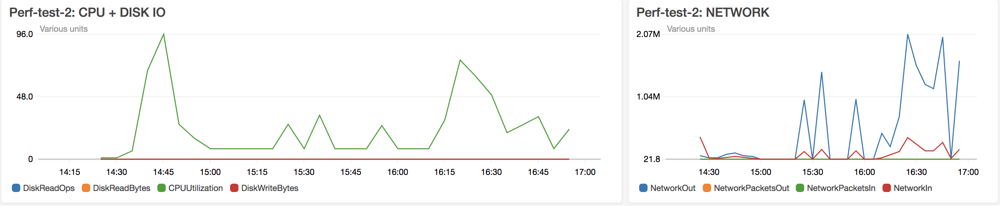

# 20180718T17h46 - Perf-test-02

## Summary of Findings
*Use Case 3* - On average we are losing 2 TPS due to manual commits with every message, and increasing the longest response time by around 5s.

*Use Case 2 vs Use Case 4* - No substantial difference between enabling auto-commits with 200ms commit interval vs disabling commits all-together.




## Use Case 1 - Base-line single message with Auto-commit enabled

### Testing Parameters:
- AWS: 1x m4.2xlarge
- 1 Transfer-Prepare Messages
- Batch Size: 1
- JMeter Threads: 1
- Commit Sync Enabled: false
- Auto-commit enabled: true
- Auto-commit interval: 200

### 1st run

#### end-to-end
```bash
First request: 2018-07-18T12:55:00.647Z
Last request: 2018-07-18T12:55:03.684Z
Total number of lines in log file: 10
Number of unique matched entries: 1
Total difference of all requests in seconds: 3.037
Shortest response time in second: 3.037
Longest response time in second: 3.037
The average transaction in second: 3.037
Average transactions per second: 0.3292723081988805
```

#### ml-api-adapter
```bash
Performance Statistics   2018-07-18 14:45:00 - 2018-07-18 15:00:00
Tag                                                  Avg(ms)         Min         Max     Std Dev       Count
metricConsumeProcessingTime                              1.0           1           1         0.0           1
metricConsumeRecursiveConsumeProcessingTime              1.0           1           1         0.0           1
metricConsumeRecursiveProcessingTime                     0.0           0           0         0.0          34
metricConsumeSyncQueueProcessingTime                     8.0           8           8         0.0           1
metricConsumeSyncQueueResolveProcessingTime              1.0           1           1         0.0           1
metricConsumerConnectProcessingTime                    205.0         205         205         0.0           1
metricMlAPIConsumeMessage                               50.0          50          50         0.0           1
metricMlAPIConsumeMessageForEachMsg                     50.0          50          50         0.0           1
metricMlAPIProcessMessage                               49.0          49          49         0.0           1
metricMlAPIRoutePrepare                                118.0         118         118         0.0           1
metricMlAPIStartConsume                                210.0         210         210         0.0           1
metricProducerConnectProcessingTime                    115.0         115         115         0.0           1
metricProducerSendMessageProcessingTime                  0.0           0           0         0.0           1
```

#### central-ledger
```bash
Performance Statistics   2018-07-18 14:45:00 - 2018-07-18 15:00:00
Tag                                                  Avg(ms)         Min         Max     Std Dev       Count
metricCenLedgerCreateFulfilHandler                     685.0         685         685         0.0           1
metricCenLedgerCreateHandler                           533.6         108        1243       436.9           7
metricCenLedgerCreatePositionHandlers                  159.0         108         210        51.0           2
metricCenLedgerCreatePrepareHandler                    271.3         203         408        96.6           3
metricCenLedgerCreateRejectHandler                    1244.0        1244        1244         0.0           1
metricCenLedgerCreateTransferHandler                  1085.0        1085        1085         0.0           1
metricCenLedgerPositions                                68.0          68          68         0.0           1
metricCenLedgerProduceMessage                          530.0           1        1585       746.0           3
metricCenLedgerRegisterAllHandlers                    3783.0        3783        3783         0.0           1
metricCenLedgerRegisterAllPositionHandlers             321.0         321         321         0.0           1
metricCenLedgerRegisterAllTransferHandlers            3424.0        3424        3424         0.0           1
metricCenLedgerRegisterPositionHandlers                321.0         321         321         0.0           1
metricCenLedgerTransferPrepare                        1653.0        1653        1653         0.0           1
metricCenLedgerTransferTransfer                          2.0           2           2         0.0           1
metricConsumeProcessingTime                              0.1           0           1         0.3           7
metricConsumeRecursiveConsumeProcessingTime              0.3           0           1         0.5           3
metricConsumeRecursiveProcessingTime                     0.0           0           0         0.0         147
metricConsumeSyncQueueProcessingTime                     1.3           1           2         0.5           3
metricConsumeSyncQueueResolveProcessingTime              0.3           0           1         0.5           3
metricConsumerConnectProcessingTime                    532.1         107        1242       437.2           7
metricProducerConnectProcessingTime                   1583.0        1583        1583         0.0           1
metricProducerSendMessageProcessingTime                  0.7           0           1         0.5           3
```

### 2nd run

#### end-to-end
```bash
First request: 2018-07-18T12:57:40.937Z
Last request: 2018-07-18T12:57:43.520Z
Total number of lines in log file: 10
Number of unique matched entries: 1
Total difference of all requests in seconds: 2.583
Shortest response time in second: 2.583
Longest response time in second: 2.583
The average transaction in second: 2.583
Average transactions per second: 0.3871467286101432
```

#### ml-api-adapter
```bash
Performance Statistics   2018-07-18 14:45:00 - 2018-07-18 15:00:00
Tag                                                  Avg(ms)         Min         Max     Std Dev       Count
metricConsumeProcessingTime                              1.0           1           1         0.0           1
metricConsumeRecursiveConsumeProcessingTime              1.0           1           1         0.0           1
metricConsumeRecursiveProcessingTime                     0.0           0           0         0.0          26
metricConsumeSyncQueueProcessingTime                     8.0           8           8         0.0           1
metricConsumeSyncQueueResolveProcessingTime              1.0           1           1         0.0           1
metricConsumerConnectProcessingTime                    204.0         204         204         0.0           1
metricMlAPIConsumeMessage                               53.0          53          53         0.0           1
metricMlAPIConsumeMessageForEachMsg                     52.0          52          52         0.0           1
metricMlAPIProcessMessage                               51.0          51          51         0.0           1
metricMlAPIRoutePrepare                                125.0         125         125         0.0           1
metricMlAPIStartConsume                                210.0         210         210         0.0           1
metricProducerConnectProcessingTime                    121.0         121         121         0.0           1
metricProducerSendMessageProcessingTime                  0.0           0           0         0.0           1
```

#### central-ledger
```bash
Performance Statistics   2018-07-18 14:45:00 - 2018-07-18 15:00:00
Tag                                                  Avg(ms)         Min         Max     Std Dev       Count
metricCenLedgerCreateFulfilHandler                     789.0         789         789         0.0           1
metricCenLedgerCreateHandler                           532.7         104        1202       452.8           7
metricCenLedgerCreatePositionHandlers                  157.0         110         204        47.0           2
metricCenLedgerCreatePrepareHandler                    206.7         104         311        84.5           3
metricCenLedgerCreateRejectHandler                    1202.0        1202        1202         0.0           1
metricCenLedgerCreateTransferHandler                  1118.0        1118        1118         0.0           1
metricCenLedgerPositions                                73.0          73          73         0.0           1
metricCenLedgerProduceMessage                          366.3           1        1097       516.7           3
metricCenLedgerRegisterAllHandlers                    3780.0        3780        3780         0.0           1
metricCenLedgerRegisterAllPositionHandlers             318.0         318         318         0.0           1
metricCenLedgerRegisterAllTransferHandlers            3421.0        3421        3421         0.0           1
metricCenLedgerRegisterPositionHandlers                318.0         318         318         0.0           1
metricCenLedgerTransferPrepare                        1187.0        1187        1187         0.0           1
metricCenLedgerTransferTransfer                          1.0           1           1         0.0           1
metricConsumeProcessingTime                              0.1           0           1         0.3           7
metricConsumeRecursiveConsumeProcessingTime              0.0           0           0         0.0           3
metricConsumeRecursiveProcessingTime                     0.0           0           0         0.0         111
metricConsumeSyncQueueProcessingTime                     2.3           1           5         1.9           3
metricConsumeSyncQueueResolveProcessingTime              0.7           0           1         0.5           3
metricConsumerConnectProcessingTime                    531.1         103        1200       453.0           7
metricProducerConnectProcessingTime                   1095.0        1095        1095         0.0           1
metricProducerSendMessageProcessingTime                  0.3           0           1         0.5           3
```

## Use Case 2 - Base-line 100 messages with Auto-commit enabled + manual commits disabled

### Testing Parameters:
- AWS: 1x m4.2xlarge
- Batch Size: 1
- JMeter Threads: 10
- 100 Transfer-Prepare Messages (10 per thread)
- Commit Sync Enabled: false
- Auto-commit enabled: true
- Auto-commit interval: 200

### 1st run

#### end-to-end
```bash
First request: 2018-07-18T14:38:55.349Z
Last request: 2018-07-18T14:39:10.719Z
Total number of lines in log file: 1000
Number of unique matched entries: 100
Total difference of all requests in seconds: 15.37
Shortest response time in second: 1.735
Longest response time in second: 13.522
The average transaction in second: 8.21128
Average transactions per second: 6.506180871828237
```

#### ml-api-adapter
```bash
Performance Statistics   2018-07-18 16:30:00 - 2018-07-18 16:45:00
Tag                                                  Avg(ms)         Min         Max     Std Dev       Count
metricConsumeProcessingTime                              1.0           1           1         0.0           1
metricConsumeRecursiveConsumeProcessingTime              0.2           0           3         0.5         100
metricConsumeRecursiveProcessingTime                     0.0           0           1         0.1         127
metricConsumeSyncQueueProcessingTime                     1.4           0           9         1.3         100
metricConsumeSyncQueueResolveProcessingTime              0.2           0           1         0.4         100
metricConsumerConnectProcessingTime                    104.0         104         104         0.0           1
metricMlAPIConsumeMessage                                7.3           4          54         5.6         100
metricMlAPIConsumeMessageForEachMsg                      7.0           4          54         5.6         100
metricMlAPIProcessMessage                                6.5           4          54         5.6         100
metricMlAPIRoutePrepare                                  2.4           0         121        12.0         100
metricMlAPIStartConsume                                110.0         110         110         0.0           1
metricProducerConnectProcessingTime                    113.0         113         113         0.0           1
metricProducerSendMessageProcessingTime                  0.2           0           1         0.4         100
```

#### central-ledger
```bash
Performance Statistics   2018-07-18 16:30:00 - 2018-07-18 16:45:00
Tag                                                  Avg(ms)         Min         Max     Std Dev       Count
metricCenLedgerCreateFulfilHandler                     785.0         785         785         0.0           1
metricCenLedgerCreateHandler                           532.6         104        1206       451.7           7
metricCenLedgerCreatePositionHandlers                  209.5         208         211         1.5           2
metricCenLedgerCreatePrepareHandler                    140.0         104         211        50.2           3
metricCenLedgerCreateRejectHandler                    1207.0        1207        1207         0.0           1
metricCenLedgerCreateTransferHandler                  1111.0        1111        1111         0.0           1
metricCenLedgerPositions                                 9.6           5          69         8.9         100
metricCenLedgerProduceMessage                            5.0           0        1219        70.2         300
metricCenLedgerRegisterAllHandlers                    3786.0        3786        3786         0.0           1
metricCenLedgerRegisterAllPositionHandlers             424.0         424         424         0.0           1
metricCenLedgerRegisterAllTransferHandlers            3316.0        3316        3316         0.0           1
metricCenLedgerRegisterPositionHandlers                424.0         424         424         0.0           1
metricCenLedgerTransferPrepare                          49.1          22        1301       126.6         100
metricCenLedgerTransferTransfer                          1.6           0           7         1.0         100
metricConsumeProcessingTime                              0.1           0           1         0.3           7
metricConsumeRecursiveConsumeProcessingTime              0.1           0           1         0.2         300
metricConsumeRecursiveProcessingTime                     0.0           0           1         0.1         461
metricConsumeSyncQueueProcessingTime                     0.5           0           4         0.6         300
metricConsumeSyncQueueResolveProcessingTime              0.2           0           2         0.4         300
metricConsumerConnectProcessingTime                    531.0         103        1204       451.8           7
metricProducerConnectProcessingTime                   1217.0        1217        1217         0.0           1
metricProducerSendMessageProcessingTime                  0.3           0           8         0.7         300
```

#### JMeter

Label | # Samples | Average | Min | Max | Std. Dev. | Error % | Throughput | Received KB/sec | Sent KB/sec | Avg. Bytes
--- | --- | --- | --- | --- | --- | --- | --- | --- | --- | ---
HTTP Request | 100 | 8 | 3 | 164 | 16.38 | 0.000% | 53.07856 | 6.74 | 69.41 | 130.0
TOTAL | 100 | 8 | 3 | 164 | 16.38 | 0.000% | 53.07856 | 6.74 | 69.41 | 130.0

### 2nd run

#### end-to-end
```bash
First request: 2018-07-18T14:42:22.837Z
Last request: 2018-07-18T14:42:37.533Z
Total number of lines in log file: 1000
Number of unique matched entries: 100
Total difference of all requests in seconds: 14.696
Shortest response time in second: 0.981
Longest response time in second: 12.851
The average transaction in second: 7.92211
Average transactions per second: 6.804572672836146
```

#### ml-api-adapter
```bash
Performance Statistics   2018-07-18 16:30:00 - 2018-07-18 16:45:00
Tag                                                  Avg(ms)         Min         Max     Std Dev       Count
metricConsumeProcessingTime                              1.0           1           1         0.0           1
metricConsumeRecursiveConsumeProcessingTime              0.2           0           1         0.4         100
metricConsumeRecursiveProcessingTime                     0.1           0           4         0.4         144
metricConsumeSyncQueueProcessingTime                     1.5           0          15         1.7         100
metricConsumeSyncQueueResolveProcessingTime              0.3           0           6         0.7         100
metricConsumerConnectProcessingTime                    205.0         205         205         0.0           1
metricMlAPIConsumeMessage                                7.8           4          54         6.7         100
metricMlAPIConsumeMessageForEachMsg                      7.2           4          54         6.1         100
metricMlAPIProcessMessage                                6.6           4          54         6.0         100
metricMlAPIRoutePrepare                                  4.2           0         236        23.5         100
metricMlAPIStartConsume                                211.0         211         211         0.0           1
metricProducerConnectProcessingTime                    228.0         228         228         0.0           1
metricProducerSendMessageProcessingTime                  0.5           0          10         1.2         100
```

#### central-ledger
```bash
Performance Statistics   2018-07-18 16:30:00 - 2018-07-18 16:45:00
Tag                                                  Avg(ms)         Min         Max     Std Dev       Count
metricCenLedgerCreateFulfilHandler                     688.0         688         688         0.0           1
metricCenLedgerCreateHandler                           543.9         103        1201       450.4           7
metricCenLedgerCreatePositionHandlers                  207.5         203         212         4.5           2
metricCenLedgerCreatePrepareHandler                    205.0         103         309        84.1           3
metricCenLedgerCreateRejectHandler                    1201.0        1201        1201         0.0           1
metricCenLedgerCreateTransferHandler                  1199.0        1199        1199         0.0           1
metricCenLedgerPositions                                 9.9           5          67         8.0         100
metricCenLedgerProduceMessage                            3.2           0         691        39.8         300
metricCenLedgerRegisterAllHandlers                    3857.0        3857        3857         0.0           1
metricCenLedgerRegisterAllPositionHandlers             419.0         419         419         0.0           1
metricCenLedgerRegisterAllTransferHandlers            3397.0        3397        3397         0.0           1
metricCenLedgerRegisterPositionHandlers                419.0         419         419         0.0           1
metricCenLedgerTransferPrepare                          43.3          23         774        74.7         100
metricCenLedgerTransferTransfer                          1.6           0           7         1.3         100
metricConsumeProcessingTime                              0.3           0           1         0.5           7
metricConsumeRecursiveConsumeProcessingTime              0.1           0           3         0.3         300
metricConsumeRecursiveProcessingTime                     0.0           0           2         0.1         540
metricConsumeSyncQueueProcessingTime                     0.6           0          15         1.1         300
metricConsumeSyncQueueResolveProcessingTime              0.2           0           5         0.5         300
metricConsumerConnectProcessingTime                    542.1         103        1199       450.6           7
metricProducerConnectProcessingTime                    688.0         688         688         0.0           1
metricProducerSendMessageProcessingTime                  0.2           0           3         0.5         300
```
#### JMeter

Label | # Samples | Average | Min | Max | Std. Dev. | Error % | Throughput | Received KB/sec | Sent KB/sec | Avg. Bytes
--- | --- | --- | --- | --- | --- | --- | --- | --- | --- | ---
HTTP Request | 100 | 11 | 3 | 282 | 28.23 | 0.000% | 52.82620 | 6.71 | 69.08 | 130.0
TOTAL | 100 | 11 | 3 | 282 | 28.23 | 0.000% | 52.82620 | 6.71 | 69.08 | 130.0


## Use Case 3 - Base-line 100 messages with Auto-commit disabled + manual commits enabled

### Testing Parameters:
- AWS: 1x m4.2xlarge
- Batch Size: 1
- JMeter Threads: 10
- 100 Transfer-Prepare Messages (10 per thread)
- Commit Sync Enabled: true
- Auto-commit enabled: false
- Auto-commit interval: 200 (n/a)

### 1st run

#### end-to-end
```bash
First request: 2018-07-18T14:46:40.437Z
Last request: 2018-07-18T14:47:01.163Z
Total number of lines in log file: 1000
Number of unique matched entries: 100
Total difference of all requests in seconds: 20.726
Shortest response time in second: 2.375
Longest response time in second: 18.909
The average transaction in second: 11.35484
Average transactions per second: 4.824857666698833
```

#### ml-api-adapter
```bash
Performance Statistics   2018-07-18 16:45:00 - 2018-07-18 17:00:00
Tag                                                  Avg(ms)         Min         Max     Std Dev       Count
metricCommitMessageSyncProcessingTime                    5.5           0          21         4.6         100
metricConsumeProcessingTime                              1.0           1           1         0.0           1
metricConsumeRecursiveConsumeProcessingTime              0.3           0           1         0.4         100
metricConsumeRecursiveProcessingTime                     0.0           0           1         0.2         120
metricConsumeSyncQueueProcessingTime                     1.1           0          11         1.3         100
metricConsumeSyncQueueResolveProcessingTime              0.2           0           3         0.5         100
metricConsumerConnectProcessingTime                    204.0         204         204         0.0           1
metricMlAPIConsumeMessage                               12.5           6          44         6.2         100
metricMlAPIConsumeMessageForEachMsg                     12.3           5          43         6.2         100
metricMlAPIProcessMessage                                6.1           3          39         3.9         100
metricMlAPIRoutePrepare                                  2.7           0         120        11.8         100
metricMlAPIStartConsume                                209.0         209         209         0.0           1
metricProducerConnectProcessingTime                    115.0         115         115         0.0           1
metricProducerSendMessageProcessingTime                  0.4           0           2         0.5         100
```

#### central-ledger
```bash
Performance Statistics   2018-07-18 16:45:00 - 2018-07-18 17:00:00
Tag                                                  Avg(ms)         Min         Max     Std Dev       Count
metricCenLedgerCreateFulfilHandler                     587.0         587         587         0.0           1
metricCenLedgerCreateHandler                           459.0         203        1391       404.2           7
metricCenLedgerCreatePositionHandlers                  207.0         204         210         3.0           2
metricCenLedgerCreatePrepareHandler                    274.0         203         412        97.6           3
metricCenLedgerCreateRejectHandler                     412.0         412         412         0.0           1
metricCenLedgerCreateTransferHandler                  1391.0        1391        1391         0.0           1
metricCenLedgerPositions                                17.7           7          84        11.9         100
metricCenLedgerProduceMessage                            4.2           0        1083        62.4         300
metricCenLedgerRegisterAllHandlers                    3263.0        3263        3263         0.0           1
metricCenLedgerRegisterAllPositionHandlers             418.0         418         418         0.0           1
metricCenLedgerRegisterAllTransferHandlers            2805.0        2805        2805         0.0           1
metricCenLedgerRegisterPositionHandlers                418.0         418         418         0.0           1
metricCenLedgerTransferPrepare                          64.7          27        1206       118.5         100
metricCenLedgerTransferTransfer                          9.0           1          28         5.4         100
metricCommitMessageSyncProcessingTime                    8.1           0         147        13.5         300
metricConsumeProcessingTime                              0.6           0           2         0.7           7
metricConsumeRecursiveConsumeProcessingTime              0.1           0           1         0.3         300
metricConsumeRecursiveProcessingTime                     0.0           0           1         0.1         447
metricConsumeSyncQueueProcessingTime                     0.5           0           4         0.6         300
metricConsumeSyncQueueResolveProcessingTime              0.2           0           2         0.4         300
metricConsumerConnectProcessingTime                    457.1         202        1388       404.0           7
metricProducerConnectProcessingTime                   1081.0        1081        1081         0.0           1
metricProducerSendMessageProcessingTime                  0.2           0           2         0.4         300
```

#### JMeter

Label | # Samples | Average | Min | Max | Std. Dev. | Error % | Throughput | Received KB/sec | Sent KB/sec | Avg. Bytes
--- | --- | --- | --- | --- | --- | --- | --- | --- | --- | ---
HTTP Request | 100 | 10 | 3 | 172 | 17.47 | 0.000% | 53.64807 | 6.81 | 70.15 | 130.0
TOTAL | 100 | 10 | 3 | 172 | 17.47 | 0.000% | 53.64807 | 6.81 | 70.15 | 130.0

### 2nd run

#### end-to-end
```bash
First request: 2018-07-18T14:49:23.307Z
Last request: 2018-07-18T14:49:46.961Z
Total number of lines in log file: 1000
Number of unique matched entries: 100
Total difference of all requests in seconds: 23.654
Shortest response time in second: 3.194
Longest response time in second: 21.819
The average transaction in second: 12.74315
Average transactions per second: 4.22761477974127
```

#### ml-api-adapter
```bash
Performance Statistics   2018-07-18 16:45:00 - 2018-07-18 17:00:00
Tag                                                  Avg(ms)         Min         Max     Std Dev       Count
metricCommitMessageSyncProcessingTime                    6.3           0          40         6.0         100
metricConsumeProcessingTime                              1.0           1           1         0.0           1
metricConsumeRecursiveConsumeProcessingTime              0.3           0           1         0.5         100
metricConsumeRecursiveProcessingTime                     0.0           0           1         0.1         123
metricConsumeSyncQueueProcessingTime                     1.2           0           7         0.9         100
metricConsumeSyncQueueResolveProcessingTime              0.2           0           2         0.4         100
metricConsumerConnectProcessingTime                    204.0         204         204         0.0           1
metricMlAPIConsumeMessage                               14.6           6          61         9.2         100
metricMlAPIConsumeMessageForEachMsg                     14.2           6          60         9.1         100
metricMlAPIProcessMessage                                7.2           4          42         5.6         100
metricMlAPIRoutePrepare                                  3.1           0         119        11.9         100
metricMlAPIStartConsume                                210.0         210         210         0.0           1
metricProducerConnectProcessingTime                    112.0         112         112         0.0           1
metricProducerSendMessageProcessingTime                  0.3           0           2         0.5         100
```

#### central-ledger
```bash
Performance Statistics   2018-07-18 16:45:00 - 2018-07-18 17:00:00
Tag                                                  Avg(ms)         Min         Max     Std Dev       Count
metricCenLedgerCreateFulfilHandler                     588.0         588         588         0.0           1
metricCenLedgerCreateHandler                           462.1         203        1417       413.3           7
metricCenLedgerCreatePositionHandlers                  207.0         204         210         3.0           2
metricCenLedgerCreatePrepareHandler                    272.0         203         409        96.9           3
metricCenLedgerCreateRejectHandler                     412.0         412         412         0.0           1
metricCenLedgerCreateTransferHandler                  1418.0        1418        1418         0.0           1
metricCenLedgerPositions                                19.3           6         105        16.6         100
metricCenLedgerProduceMessage                            4.3           0        1068        61.5         300
metricCenLedgerRegisterAllHandlers                    3288.0        3288        3288         0.0           1
metricCenLedgerRegisterAllPositionHandlers             419.0         419         419         0.0           1
metricCenLedgerRegisterAllTransferHandlers            2828.0        2828        2828         0.0           1
metricCenLedgerRegisterPositionHandlers                418.0         418         418         0.0           1
metricCenLedgerTransferPrepare                          71.7          26        1212       118.0         100
metricCenLedgerTransferTransfer                         10.3           2         107        12.2         100
metricCommitMessageSyncProcessingTime                    8.3           0         103        10.6         300
metricConsumeProcessingTime                              0.3           0           1         0.5           7
metricConsumeRecursiveConsumeProcessingTime              0.1           0           1         0.3         300
metricConsumeRecursiveProcessingTime                     0.0           0           1         0.1         473
metricConsumeSyncQueueProcessingTime                     0.6           0           4         0.6         300
metricConsumeSyncQueueResolveProcessingTime              0.2           0           2         0.4         300
metricConsumerConnectProcessingTime                    460.9         202        1416       413.5           7
metricProducerConnectProcessingTime                   1065.0        1065        1065         0.0           1
metricProducerSendMessageProcessingTime                  0.2           0           4         0.5         300
```

#### JMeter

Label | # Samples | Average | Min | Max | Std. Dev. | Error % | Throughput | Received KB/sec | Sent KB/sec | Avg. Bytes
--- | --- | --- | --- | --- | --- | --- | --- | --- | --- | ---
HTTP Request | 100 | 10 | 3 | 164 | 16.34 | 0.000% | 53.44735 | 6.79 | 69.89 | 130.0
TOTAL | 100 | 10 | 3 | 164 | 16.34 | 0.000% | 53.44735 | 6.79 | 69.89 | 130.0

## Use Case 4 - Base-line 100 messages with Auto-commit disabled + manual commits disabled

### Testing Parameters:
- AWS: 1x m4.2xlarge
- Batch Size: 1
- JMeter Threads: 10
- 100 Transfer-Prepare Messages (10 per thread)
- Commit Sync Enabled: false
- Auto-commit enabled: false
- Auto-commit interval: 200 (n/a)

### 1st run

#### end-to-end
```bash
First request: 2018-07-18T14:56:30.398Z
Last request: 2018-07-18T14:56:46.250Z
Total number of lines in log file: 1000
Number of unique matched entries: 100
Total difference of all requests in seconds: 15.852
Shortest response time in second: 1.416
Longest response time in second: 14.031
The average transaction in second: 8.3234
Average transactions per second: 6.308352258390109
```

#### ml-api-adapter
```bash
Performance Statistics   2018-07-18 16:45:00 - 2018-07-18 17:00:00
Tag                                                  Avg(ms)         Min         Max     Std Dev       Count
metricConsumeProcessingTime                              1.0           1           1         0.0           1
metricConsumeRecursiveConsumeProcessingTime              0.2           0           1         0.4         100
metricConsumeRecursiveProcessingTime                     0.0           0           1         0.1         131
metricConsumeSyncQueueProcessingTime                     1.3           0           8         0.9         100
metricConsumeSyncQueueResolveProcessingTime              0.2           0           2         0.4         100
metricConsumerConnectProcessingTime                    204.0         204         204         0.0           1
metricMlAPIConsumeMessage                                7.0           4          38         4.0         100
metricMlAPIConsumeMessageForEachMsg                      6.6           4          36         3.8         100
metricMlAPIProcessMessage                                6.1           3          36         3.8         100
metricMlAPIRoutePrepare                                  3.8           0         220        21.9         100
metricMlAPIStartConsume                                210.0         210         210         0.0           1
metricProducerConnectProcessingTime                    212.0         212         212         0.0           1
metricProducerSendMessageProcessingTime                  0.4           0          15         1.5         100
```

#### central-ledger
```bash
Performance Statistics   2018-07-18 16:45:00 - 2018-07-18 17:00:00
Tag                                                  Avg(ms)         Min         Max     Std Dev       Count
metricCenLedgerCreateFulfilHandler                     706.0         706         706         0.0           1
metricCenLedgerCreateHandler                           446.3         104        1307       397.0           7
metricCenLedgerCreatePositionHandlers                  207.0         203         211         4.0           2
metricCenLedgerCreatePrepareHandler                    205.0         104         308        83.3           3
metricCenLedgerCreateRejectHandler                     392.0         392         392         0.0           1
metricCenLedgerCreateTransferHandler                  1309.0        1309        1309         0.0           1
metricCenLedgerPositions                                12.0           5          81        13.6         100
metricCenLedgerProduceMessage                            4.5           0        1095        63.1         300
metricCenLedgerRegisterAllHandlers                    3174.0        3174        3174         0.0           1
metricCenLedgerRegisterAllPositionHandlers             417.0         417         417         0.0           1
metricCenLedgerRegisterAllTransferHandlers            2716.0        2716        2716         0.0           1
metricCenLedgerRegisterPositionHandlers                417.0         417         417         0.0           1
metricCenLedgerTransferPrepare                          49.4          22        1216       118.2         100
metricCenLedgerTransferTransfer                          1.5           0           5         0.9         100
metricConsumeProcessingTime                              0.3           0           1         0.5           7
metricConsumeRecursiveConsumeProcessingTime              0.1           0           1         0.2         300
metricConsumeRecursiveProcessingTime                     0.0           0           1         0.1         487
metricConsumeSyncQueueProcessingTime                     0.5           0           4         0.6         300
metricConsumeSyncQueueResolveProcessingTime              0.2           0           3         0.4         300
metricConsumerConnectProcessingTime                    444.7         103        1306       397.3           7
metricProducerConnectProcessingTime                   1093.0        1093        1093         0.0           1
metricProducerSendMessageProcessingTime                  0.2           0           3         0.5         300
```

#### JMeter

Label | # Samples | Average | Min | Max | Std. Dev. | Error % | Throughput | Received KB/sec | Sent KB/sec | Avg. Bytes
--- | --- | --- | --- | --- | --- | --- | --- | --- | --- | ---
HTTP Request | 100 | 11 | 3 | 258 | 25.56 | 0.000% | 53.82131 | 6.83 | 70.38 | 130.0
TOTAL | 100 | 11 | 3 | 258 | 25.56 | 0.000% | 53.82131 | 6.83 | 70.38 | 130.0


### 2nd run

#### end-to-end
```bash
First request: 2018-07-18T15:01:56.491Z
Last request: 2018-07-18T15:02:11.057Z
Total number of lines in log file: 1000
Number of unique matched entries: 100
Total difference of all requests in seconds: 14.566
Shortest response time in second: 1.732
Longest response time in second: 12.676
The average transaction in second: 7.74921
Average transactions per second: 6.865302759851709
```

#### ml-api-adapter
```bash
Performance Statistics   2018-07-18 17:00:00 - 2018-07-18 17:15:00
Tag                                                  Avg(ms)         Min         Max     Std Dev       Count
metricConsumeProcessingTime                              2.0           2           2         0.0           1
metricConsumeRecursiveConsumeProcessingTime              0.2           0           2         0.4         100
metricConsumeRecursiveProcessingTime                     0.0           0           1         0.2         119
metricConsumeSyncQueueProcessingTime                     1.4           0          12         1.5         100
metricConsumeSyncQueueResolveProcessingTime              0.2           0           2         0.4         100
metricConsumerConnectProcessingTime                    206.0         206         206         0.0           1
metricMlAPIConsumeMessage                                7.6           4          67         7.1         100
metricMlAPIConsumeMessageForEachMsg                      7.2           4          67         7.0         100
metricMlAPIProcessMessage                                6.7           4          66         6.9         100
metricMlAPIRoutePrepare                                  2.5           0         109        10.7         100
metricMlAPIStartConsume                                213.0         213         213         0.0           1
metricProducerConnectProcessingTime                    105.0         105         105         0.0           1
metricProducerSendMessageProcessingTime                  0.3           0           2         0.5         100
```

#### central-ledger
```bash
Performance Statistics   2018-07-18 17:00:00 - 2018-07-18 17:15:00
Tag                                                  Avg(ms)         Min         Max     Std Dev       Count
metricCenLedgerCreateFulfilHandler                     487.0         487         487         0.0           1
metricCenLedgerCreateHandler                           429.7         204        1186       334.7           7
metricCenLedgerCreatePositionHandlers                  208.0         205         211         3.0           2
metricCenLedgerCreatePrepareHandler                    272.7         204         410        97.1           3
metricCenLedgerCreateRejectHandler                     516.0         516         516         0.0           1
metricCenLedgerCreateTransferHandler                  1186.0        1186        1186         0.0           1
metricCenLedgerPositions                                 9.7           5          61         9.4         100
metricCenLedgerProduceMessage                            1.6           0         224        12.9         300
metricCenLedgerRegisterAllHandlers                    3061.0        3061        3061         0.0           1
metricCenLedgerRegisterAllPositionHandlers             419.0         419         419         0.0           1
metricCenLedgerRegisterAllTransferHandlers            2599.0        2599        2599         0.0           1
metricCenLedgerRegisterPositionHandlers                419.0         419         419         0.0           1
metricCenLedgerTransferPrepare                          40.0          23         289        28.1         100
metricCenLedgerTransferTransfer                          1.8           0           7         1.2         100
metricConsumeProcessingTime                              0.3           0           1         0.5           7
metricConsumeRecursiveConsumeProcessingTime              0.1           0           1         0.3         300
metricConsumeRecursiveProcessingTime                     0.0           0           2         0.2         429
metricConsumeSyncQueueProcessingTime                     0.6           0           4         0.7         300
metricConsumeSyncQueueResolveProcessingTime              0.2           0           2         0.4         300
metricConsumerConnectProcessingTime                    428.4         203        1185       335.0           7
metricProducerConnectProcessingTime                    217.0         217         217         0.0           1
metricProducerSendMessageProcessingTime                  0.3           0           4         0.5         300
```

#### JMeter

Label | # Samples | Average | Min | Max | Std. Dev. | Error % | Throughput | Received KB/sec | Sent KB/sec | Avg. Bytes
--- | --- | --- | --- | --- | --- | --- | --- | --- | --- | ---
HTTP Request | 100 | 9 | 3 | 155 | 15.62 | 0.000% | 51.86722 | 6.58 | 67.82 | 130.0
TOTAL | 100 | 9 | 3 | 155 | 15.62 | 0.000% | 51.86722 | 6.58 | 67.82 | 130.0

