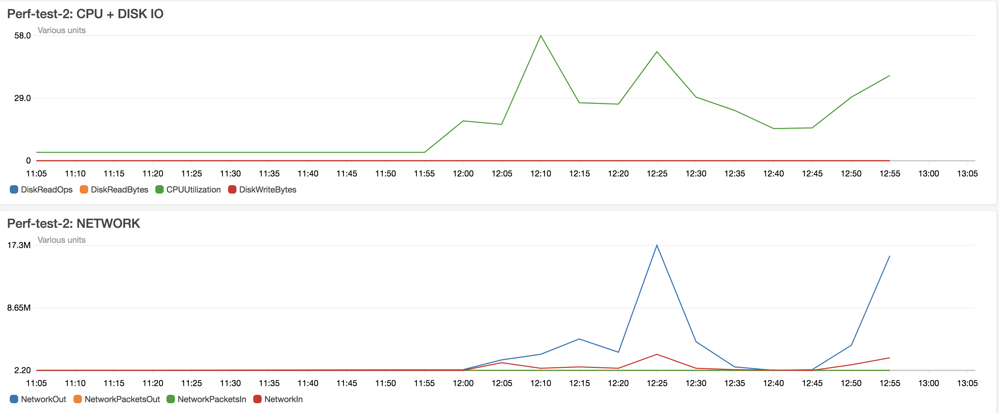

# 20180727

## AWS Cloudwatch for all tests


## Use Case 1 - 1 messages with Auto-commit disabled + manual commits enabled + Producer fix

### Testing Parameters:
- Producer Fix: true
- AWS: 1x m4.2xlarge
- Batch Size: 1
- JMeter Threads: 1
- 1 Transfer-Prepare Message
- Commit Sync Enabled: true
- Auto-commit enabled: false
- Kafka version: v1.1.0

### 1st run

#### end-to-end
```bash
First request: 2018-07-27T10:38:27.415Z
Last request: 2018-07-27T10:38:29.397Z
Total number of lines in log file: 10
Number of unique matched entries: 1
Total difference of all requests in seconds: 1.982
Shortest response time in second: 1.982
Longest response time in second: 1.982
The average transaction in second: 1.982
Average transactions per second: 0.5045408678102926
```

#### ml-api-adapter
```bash
Performance Statistics   2018-07-27 12:30:00 - 2018-07-27 12:45:00
Tag                                                  Avg(ms)         Min         Max     Std Dev       Count
metricCommitMessageSyncProcessingTime                    4.0           4           4         0.0           1
metricConsumeProcessingTime                              1.0           1           1         0.0           1
metricConsumeRecursiveConsumeProcessingTime              1.0           1           1         0.0           1
metricConsumeRecursiveProcessingTime                     0.0           0           0         0.0          28
metricConsumeSyncQueueProcessingTime                     7.0           7           7         0.0           1
metricConsumeSyncQueueResolveProcessingTime              1.0           1           1         0.0           1
metricConsumerConnectProcessingTime                    206.0         206         206         0.0           1
metricMlAPIConsumeMessage                               34.0          34          34         0.0           1
metricMlAPIConsumeMessageForEachMsg                     32.0          32          32         0.0           1
metricMlAPIProcessMessage                               28.0          28          28         0.0           1
metricMlAPIRoutePrepare                                 22.0          22          22         0.0           1
metricMlAPIStartConsume                                213.0         213         213         0.0           1
metricProducerConnectProcessingTime                     19.0          19          19         0.0           1
metricProducerSendMessageProcessingTime                  0.0           0           0         0.0           1
```

#### central-ledger
```bash
Performance Statistics   2018-07-27 12:30:00 - 2018-07-27 12:45:00
Tag                                                  Avg(ms)         Min         Max     Std Dev       Count
metricCenLedgerCreateFulfilHandler                     212.0         212         212         0.0           1
metricCenLedgerCreateHandler                           177.2         109         212        47.2           6
metricCenLedgerCreatePositionHandlers                  164.0         115         213        49.0           2
metricCenLedgerCreatePrepareHandler                    212.8         211         215         1.8           4
metricCenLedgerCreateTransferHandler                   112.0         112         112         0.0           1
metricCenLedgerPositions                               246.0         246         246         0.0           1
metricCenLedgerProduceMessage                          181.0         118         213        44.5           3
metricCenLedgerRegisterPositionHandlers                164.0         115         213        49.0           2
metricCenLedgerTransferPrepare                         347.0         347         347         0.0           1
metricCenLedgerTransferTransfer                        123.0         123         123         0.0           1
metricCommitMessageSyncProcessingTime                    1.7           1           2         0.5           3
metricConsumeProcessingTime                              1.3           1           2         0.5           6
metricConsumeRecursiveConsumeProcessingTime              0.7           0           1         0.5           3
metricConsumeRecursiveProcessingTime                     0.0           0           1         0.2         157
metricConsumeSyncQueueProcessingTime                     3.7           3           4         0.5           3
metricConsumeSyncQueueResolveProcessingTime              0.7           0           1         0.5           3
metricConsumerConnectProcessingTime                    172.3         105         206        46.9           6
metricProducerConnectProcessingTime                    178.0         116         212        43.9           3
metricProducerSendMessageProcessingTime                  0.0           0           0         0.0           3
```

### 2nd run

#### end-to-end
```bash
First request: 2018-07-27T10:40:15.826Z
Last request: 2018-07-27T10:40:17.901Z
Total number of lines in log file: 10
Number of unique matched entries: 1
Total difference of all requests in seconds: 2.075
Shortest response time in second: 2.075
Longest response time in second: 2.075
The average transaction in second: 2.075
Average transactions per second: 0.48192771084337344
```

#### ml-api-adapter
```bash
Performance Statistics   2018-07-27 12:30:00 - 2018-07-27 12:45:00
Tag                                                  Avg(ms)         Min         Max     Std Dev       Count
metricCommitMessageSyncProcessingTime                    6.0           6           6         0.0           1
metricConsumeProcessingTime                              1.0           1           1         0.0           1
metricConsumeRecursiveConsumeProcessingTime              1.0           1           1         0.0           1
metricConsumeRecursiveProcessingTime                     0.1           0           1         0.3          13
metricConsumeSyncQueueProcessingTime                     9.0           9           9         0.0           1
metricConsumeSyncQueueResolveProcessingTime              1.0           1           1         0.0           1
metricConsumerConnectProcessingTime                    205.0         205         205         0.0           1
metricMlAPIConsumeMessage                               37.0          37          37         0.0           1
metricMlAPIConsumeMessageForEachMsg                     37.0          37          37         0.0           1
metricMlAPIProcessMessage                               28.0          28          28         0.0           1
metricMlAPIRoutePrepare                                  8.0           8           8         0.0           1
metricMlAPIStartConsume                                211.0         211         211         0.0           1
metricProducerConnectProcessingTime                      5.0           5           5         0.0           1
metricProducerSendMessageProcessingTime                  0.0           0           0         0.0           1
```

#### central-ledger
```bash
Performance Statistics   2018-07-27 12:30:00 - 2018-07-27 12:45:00
Tag                                                  Avg(ms)         Min         Max     Std Dev       Count
metricCenLedgerCreateFulfilHandler                     110.0         110         110         0.0           1
metricCenLedgerCreateHandler                           192.0         108         210        37.6           6
metricCenLedgerCreatePositionHandlers                  210.0         209         211         1.0           2
metricCenLedgerCreatePrepareHandler                    211.5         211         212         0.5           4
metricCenLedgerCreateTransferHandler                   211.0         211         211         0.0           1
metricCenLedgerPositions                               318.0         318         318         0.0           1
metricCenLedgerProduceMessage                          185.0         121         223        45.5           3
metricCenLedgerRegisterPositionHandlers                210.0         209         211         1.0           2
metricCenLedgerTransferPrepare                         273.0         273         273         0.0           1
metricCenLedgerTransferTransfer                        229.0         229         229         0.0           1
metricCommitMessageSyncProcessingTime                   12.3           9          17         3.4           3
metricConsumeProcessingTime                              1.0           0           2         0.6           6
metricConsumeRecursiveConsumeProcessingTime              0.7           0           1         0.5           3
metricConsumeRecursiveProcessingTime                     0.1           0           1         0.2          72
metricConsumeSyncQueueProcessingTime                     3.3           2           4         0.9           3
metricConsumeSyncQueueResolveProcessingTime              1.0           1           1         0.0           3
metricConsumerConnectProcessingTime                    188.0         104         205        37.6           6
metricProducerConnectProcessingTime                    183.0         120         221        44.9           3
metricProducerSendMessageProcessingTime                  0.7           0           1         0.5           3
```

## Use Case 2 - 100 messages with Auto-commit disabled + manual commits enabled + Producer fix

### Testing Parameters:
- Producer Fix: true
- AWS: 1x m4.2xlarge
- Batch Size: 1
- JMeter Threads: 10
- JMeter Threads Rampup: 2
- JMeter Loops count: 2
- 100 Transfer-Prepare Message
- Commit Sync Enabled: true
- Auto-commit enabled: false
- Kafka version: v1.1.0

### 1st run

#### end-to-end
```bash
First request: 2018-07-27T10:06:01.917Z
Last request: 2018-07-27T10:06:07.444Z
Total number of lines in log file: 1000
Number of unique matched entries: 100
Total difference of all requests in seconds: 5.527
Shortest response time in second: 2.083
Longest response time in second: 3.704
The average transaction in second: 2.6966799999999997
Average transactions per second: 18.09299800977022
```

#### ml-api-adapter
```bash
Performance Statistics   2018-07-27 12:00:00 - 2018-07-27 12:15:00
Tag                                                  Avg(ms)         Min         Max     Std Dev       Count
metricCommitMessageSyncProcessingTime                    8.1           1          73         8.0         100
metricConsumeProcessingTime                              1.0           1           1         0.0           1
metricConsumeRecursiveConsumeProcessingTime              0.3           0           2         0.5         100
metricConsumeRecursiveProcessingTime                     0.1           0           1         0.2         133
metricConsumeSyncQueueProcessingTime                     1.4           0          10         1.2         100
metricConsumeSyncQueueResolveProcessingTime              0.3           0           1         0.4         100
metricConsumerConnectProcessingTime                    205.0         205         205         0.0           1
metricMlAPIConsumeMessage                               14.8           7          78         8.5         100
metricMlAPIConsumeMessageForEachMsg                     14.4           6          77         8.4         100
metricMlAPIProcessMessage                                5.5           3          19         2.9         100
metricMlAPIRoutePrepare                                  1.6           0          14         2.1         100
metricMlAPIStartConsume                                211.0         211         211         0.0           1
metricProducerConnectProcessingTime                     10.0          10          10         0.0           1
metricProducerSendMessageProcessingTime                  0.3           0           2         0.5         100
```

#### central-ledger
```bash
Performance Statistics   2018-07-27 12:00:00 - 2018-07-27 12:15:00
Tag                                                  Avg(ms)         Min         Max     Std Dev       Count
metricCenLedgerCreateFulfilHandler                     213.0         213         213         0.0           1
metricCenLedgerCreateHandler                           192.3         109         211        37.3           6
metricCenLedgerCreatePositionHandlers                  210.0         210         210         0.0           2
metricCenLedgerCreatePrepareHandler                    211.0         211         211         0.0           4
metricCenLedgerCreateTransferHandler                   111.0         111         111         0.0           1
metricCenLedgerPositions                                21.3           8         284        28.1         100
metricCenLedgerProduceMessage                            2.7           0         224        19.3         300
metricCenLedgerRegisterPositionHandlers                210.5         210         211         0.5           2
metricCenLedgerTransferPrepare                          42.2          25         276        26.0         100
metricCenLedgerTransferTransfer                         12.1           3         132        13.5         100
metricCommitMessageSyncProcessingTime                    9.7           1          82         8.4         300
metricConsumeProcessingTime                              1.2           1           2         0.4           6
metricConsumeRecursiveConsumeProcessingTime              0.1           0           1         0.3         300
metricConsumeRecursiveProcessingTime                     0.0           0           2         0.2         498
metricConsumeSyncQueueProcessingTime                     0.7           0           6         0.8         300
metricConsumeSyncQueueResolveProcessingTime              0.3           0          11         0.8         300
metricConsumerConnectProcessingTime                    188.3         106         205        36.8           6
metricProducerConnectProcessingTime                    186.7         120         221        47.1           3
metricProducerSendMessageProcessingTime                  0.2           0           3         0.4         300
```

#### JMeter

Label | # Samples | Average | Min | Max | Std. Dev. | Error % | Throughput | Received KB/sec | Sent KB/sec | Avg. Bytes
--- | --- | --- | --- | --- | --- | --- | --- | --- | --- | ---
HTTP Request | 100 | 8 | 3 | 59 | 7.63 | 0.000% | 53.76344 | 6.83 | 70.30 | 130.0
TOTAL | 100 | 8 | 3 | 59 | 7.63 | 0.000% | 53.76344 | 6.83 | 70.30 | 130.0

### 2nd run

#### end-to-end
```bash
First request: 2018-07-27T10:13:28.460Z
Last request: 2018-07-27T10:13:33.296Z
Total number of lines in log file: 1000
Number of unique matched entries: 100
Total difference of all requests in seconds: 4.836
Shortest response time in second: 1.104
Longest response time in second: 2.972
The average transaction in second: 1.97682
Average transactions per second: 20.678246484698096
```

#### ml-api-adapter
```bash
Performance Statistics   2018-07-27 12:00:00 - 2018-07-27 12:15:00
Tag                                                  Avg(ms)         Min         Max     Std Dev       Count
metricCommitMessageSyncProcessingTime                    8.9           0          39         6.9         100
metricConsumeProcessingTime                              1.0           1           1         0.0           1
metricConsumeRecursiveConsumeProcessingTime              0.4           0           3         0.6         100
metricConsumeRecursiveProcessingTime                     0.0           0           1         0.2         158
metricConsumeSyncQueueProcessingTime                     2.0           0          30         3.2         100
metricConsumeSyncQueueResolveProcessingTime              0.2           0           1         0.4         100
metricConsumerConnectProcessingTime                    106.0         106         106         0.0           1
metricMlAPIConsumeMessage                               17.7           4          77        11.2         100
metricMlAPIConsumeMessageForEachMsg                     17.3           4          76        11.2         100
metricMlAPIProcessMessage                                7.4           3          62         7.8         100
metricMlAPIRoutePrepare                                  2.1           0          34         3.6         100
metricMlAPIStartConsume                                113.0         113         113         0.0           1
metricProducerConnectProcessingTime                     27.0          27          27         0.0           1
metricProducerSendMessageProcessingTime                  0.5           0           4         0.7         100
```

#### central-ledger
```bash
Performance Statistics   2018-07-27 12:00:00 - 2018-07-27 12:15:00
Tag                                                  Avg(ms)         Min         Max     Std Dev       Count
metricCenLedgerCreateFulfilHandler                     210.0         210         210         0.0           1
metricCenLedgerCreateHandler                           209.2         208         212         1.3           6
metricCenLedgerCreatePositionHandlers                  210.5         210         211         0.5           2
metricCenLedgerCreatePrepareHandler                    212.8         210         215         2.3           4
metricCenLedgerCreateTransferHandler                   212.0         212         212         0.0           1
metricCenLedgerPositions                                21.6           7         239        30.3         100
metricCenLedgerProduceMessage                            2.6           0         221        19.1         300
metricCenLedgerRegisterPositionHandlers                210.5         210         211         0.5           2
metricCenLedgerTransferPrepare                          44.9          23         376        39.1         100
metricCenLedgerTransferTransfer                         12.4           3         190        18.6         100
metricCommitMessageSyncProcessingTime                    9.9           0         202        16.3         300
metricConsumeProcessingTime                              1.0           1           1         0.0           6
metricConsumeRecursiveConsumeProcessingTime              0.1           0           1         0.3         300
metricConsumeRecursiveProcessingTime                     0.0           0           1         0.2         581
metricConsumeSyncQueueProcessingTime                     0.8           0           4         0.7         300
metricConsumeSyncQueueResolveProcessingTime              0.3           0           8         0.7         300
metricConsumerConnectProcessingTime                    204.8         204         207         1.1           6
metricProducerConnectProcessingTime                    184.3         123         219        43.5           3
metricProducerSendMessageProcessingTime                  0.2           0           3         0.4         300
```

#### JMeter

Label | # Samples | Average | Min | Max | Std. Dev. | Error % | Throughput | Received KB/sec | Sent KB/sec | Avg. Bytes
--- | --- | --- | --- | --- | --- | --- | --- | --- | --- | ---
HTTP Request | 100 | 9 | 3 | 77 | 8.66 | 0.000% | 52.63158 | 6.68 | 68.82 | 130.0
TOTAL | 100 | 9 | 3 | 77 | 8.66 | 0.000% | 52.63158 | 6.68 | 68.82 | 130.0

## Use Case Base 3 - 100 messages with Auto-commit disabled + manual commits enabled + Producer fix
 
### Testing Parameters:
- Producer Fix: true
- AWS: 1x m4.2xlarge
- Batch Size: 1
- JMeter Threads: 20
- JMeter Threads Rampup: 2
- JMeter Loops count: 2
- 100 Transfer-Prepare Message
- Commit Sync Enabled: true
- Auto-commit enabled: false
- Kafka version: v1.1.0

### 1st run

#### end-to-end
```bash
First request: 2018-07-27T10:22:37.416Z
Last request: 2018-07-27T10:22:47.991Z
Total number of lines in log file: 2000
Number of unique matched entries: 200
Total difference of all requests in seconds: 10.575
Shortest response time in second: 2.009
Longest response time in second: 8.576
The average transaction in second: 4.923515
Average transactions per second: 18.912529550827426
```

#### ml-api-adapter
```bash
Performance Statistics   2018-07-27 12:15:00 - 2018-07-27 12:30:00
Tag                                                  Avg(ms)         Min         Max     Std Dev       Count
metricCommitMessageSyncProcessingTime                    8.3           0          84         8.8         200
metricConsumeProcessingTime                              1.0           1           1         0.0           1
metricConsumeRecursiveConsumeProcessingTime              0.3           0           3         0.5         200
metricConsumeRecursiveProcessingTime                     0.0           0           1         0.2         232
metricConsumeSyncQueueProcessingTime                     1.4           0          18         1.5         200
metricConsumeSyncQueueResolveProcessingTime              0.2           0           3         0.5         200
metricConsumerConnectProcessingTime                    106.0         106         106         0.0           1
metricMlAPIConsumeMessage                               15.1           5          92        11.0         200
metricMlAPIConsumeMessageForEachMsg                     14.7           5          91        11.0         200
metricMlAPIProcessMessage                                5.6           3          78         5.6         200
metricMlAPIRoutePrepare                                  1.8           0          31         3.0         200
metricMlAPIStartConsume                                114.0         114         114         0.0           1
metricProducerConnectProcessingTime                     27.0          27          27         0.0           1
metricProducerSendMessageProcessingTime                  0.3           0           9         0.8         200
```

#### central-ledger
```bash
Performance Statistics   2018-07-27 12:15:00 - 2018-07-27 12:30:00
Tag                                                  Avg(ms)         Min         Max     Std Dev       Count
metricCenLedgerCreateFulfilHandler                     219.0         219         219         0.0           1
metricCenLedgerCreateHandler                           146.0         110         218        49.9           6
metricCenLedgerCreatePositionHandlers                  113.0         112         114         1.0           2
metricCenLedgerCreatePrepareHandler                    165.8         113         219        52.8           4
metricCenLedgerCreateTransferHandler                   113.0         113         113         0.0           1
metricCenLedgerPositions                                19.4           7         259        19.3         200
metricCenLedgerProduceMessage                            1.8           0         223        15.4         600
metricCenLedgerRegisterPositionHandlers                113.0         112         114         1.0           2
metricCenLedgerTransferPrepare                          44.7          25         379        28.1         200
metricCenLedgerTransferTransfer                         11.9           2         232        16.7         200
metricCommitMessageSyncProcessingTime                    9.1           1         122         8.6         600
metricConsumeProcessingTime                              1.3           1           2         0.5           6
metricConsumeRecursiveConsumeProcessingTime              0.1           0           1         0.3         600
metricConsumeRecursiveProcessingTime                     0.0           0           1         0.2         813
metricConsumeSyncQueueProcessingTime                     0.7           0           7         0.8         600
metricConsumeSyncQueueResolveProcessingTime              0.3           0           9         0.6         600
metricConsumerConnectProcessingTime                    140.0         104         212        49.2           6
metricProducerConnectProcessingTime                    215.3         210         220         4.1           3
metricProducerSendMessageProcessingTime                  0.2           0           2         0.4         600
```

#### JMeter

Label | # Samples | Average | Min | Max | Std. Dev. | Error % | Throughput | Received KB/sec | Sent KB/sec | Avg. Bytes
--- | --- | --- | --- | --- | --- | --- | --- | --- | --- | ---
HTTP Request | 200 | 10 | 3 | 77 | 12.15 | 0.000% | 97.94319 | 12.43 | 128.07 | 130.0
TOTAL | 200 | 10 | 3 | 77 | 12.15 | 0.000% | 97.94319 | 12.43 | 128.07 | 130.0


### 2nd run

#### end-to-end
```bash
First request: 2018-07-27T10:19:12.389Z
Last request: 2018-07-27T10:19:22.275Z
Total number of lines in log file: 2000
Number of unique matched entries: 200
Total difference of all requests in seconds: 9.886
Shortest response time in second: 2.123
Longest response time in second: 7.97
The average transaction in second: 4.85349
Average transactions per second: 20.23062917256727
```

#### ml-api-adapter
```bash
Performance Statistics   2018-07-27 12:15:00 - 2018-07-27 12:30:00
Tag                                                  Avg(ms)         Min         Max     Std Dev       Count
metricCommitMessageSyncProcessingTime                    9.2           0         127        10.1         200
metricConsumeProcessingTime                              1.0           1           1         0.0           1
metricConsumeRecursiveConsumeProcessingTime              0.3           0           4         0.6         200
metricConsumeRecursiveProcessingTime                     0.0           0           1         0.1         218
metricConsumeSyncQueueProcessingTime                     1.7           0          31         2.6         200
metricConsumeSyncQueueResolveProcessingTime              0.2           0           4         0.5         200
metricConsumerConnectProcessingTime                    113.0         113         113         0.0           1
metricMlAPIConsumeMessage                               16.6           5         138        11.8         200
metricMlAPIConsumeMessageForEachMsg                     16.1           5         138        11.8         200
metricMlAPIProcessMessage                                6.2           2          55         5.9         200
metricMlAPIRoutePrepare                                  1.5           0          21         2.0         200
metricMlAPIStartConsume                                120.0         120         120         0.0           1
metricProducerConnectProcessingTime                     18.0          18          18         0.0           1
metricProducerSendMessageProcessingTime                  0.3           0           3         0.5         200
```

#### central-ledger
```bash
Performance Statistics   2018-07-27 12:15:00 - 2018-07-27 12:30:00
Tag                                                  Avg(ms)         Min         Max     Std Dev       Count
metricCenLedgerCreateFulfilHandler                     212.0         212         212         0.0           1
metricCenLedgerCreateHandler                           210.5         209         214         1.6           6
metricCenLedgerCreatePositionHandlers                  212.5         212         213         0.5           2
metricCenLedgerCreatePrepareHandler                    216.3         216         217         0.4           4
metricCenLedgerCreateTransferHandler                   213.0         213         213         0.0           1
metricCenLedgerPositions                                19.8           7         138        15.4         200
metricCenLedgerProduceMessage                            1.6           0         224        13.4         600
metricCenLedgerRegisterPositionHandlers                212.5         212         213         0.5           2
metricCenLedgerTransferPrepare                          41.9          21         361        27.4         200
metricCenLedgerTransferTransfer                         11.4           2         230        16.8         200
metricCommitMessageSyncProcessingTime                    8.8           0         127        10.5         600
metricConsumeProcessingTime                              1.0           1           1         0.0           6
metricConsumeRecursiveConsumeProcessingTime              0.1           0           1         0.3         600
metricConsumeRecursiveProcessingTime                     0.0           0           8         0.3         726
metricConsumeSyncQueueProcessingTime                     0.7           0           9         0.9         600
metricConsumeSyncQueueResolveProcessingTime              0.3           0           8         0.6         600
metricConsumerConnectProcessingTime                    206.3         205         210         1.8           6
metricProducerConnectProcessingTime                    182.3         121         221        43.9           3
metricProducerSendMessageProcessingTime                  0.2           0           2         0.4         600
```
#### JMeter

Label | # Samples | Average | Min | Max | Std. Dev. | Error % | Throughput | Received KB/sec | Sent KB/sec | Avg. Bytes
--- | --- | --- | --- | --- | --- | --- | --- | --- | --- | ---
HTTP Request | 200 | 6 | 3 | 79 | 6.37 | 0.000% | 101.62602 | 12.90 | 132.89 | 130.0
TOTAL | 200 | 6 | 3 | 79 | 6.37 | 0.000% | 101.62602 | 12.90 | 132.89 | 130.0


## Use Case 4 - 1000 messages with Auto-commit disabled + manual commits enabled + Producer fix
 
### Testing Parameters:
- Producer Fix: true
- AWS: 1x m4.2xlarge
- Batch Size: 1
- JMeter Threads: 100
- JMeter Threads Rampup: 2
- JMeter Loops count: 10
- 1000 Transfer-Prepare Message
- Commit Sync Enabled: true
- Auto-commit enabled: false
- Kafka version: v1.1.0

### 1st run

#### end-to-end
```bash
First request: 2018-07-27T10:26:11.974Z
Last request: 2018-07-27T10:26:54.428Z
Total number of lines in log file: 10000
Number of unique matched entries: 1000
Total difference of all requests in seconds: 42.454
Shortest response time in second: 5.01
Longest response time in second: 37.178
The average transaction in second: 20.405809
Average transactions per second: 23.554906487021245
```

#### ml-api-adapter
```bash
Performance Statistics   2018-07-27 12:15:00 - 2018-07-27 12:30:00
Tag                                                  Avg(ms)         Min         Max     Std Dev       Count
metricCommitMessageSyncProcessingTime                    8.2           0         118         8.0        1000
metricConsumeProcessingTime                              1.0           1           1         0.0           1
metricConsumeRecursiveConsumeProcessingTime              0.2           0          11         0.6        1000
metricConsumeRecursiveProcessingTime                     0.0           0           2         0.2        1044
metricConsumeSyncQueueProcessingTime                     1.2           0          24         1.4        1000
metricConsumeSyncQueueResolveProcessingTime              0.2           0           5         0.4        1000
metricConsumerConnectProcessingTime                    206.0         206         206         0.0           1
metricMlAPIConsumeMessage                               16.1           4        1444        46.3        1000
metricMlAPIConsumeMessageForEachMsg                     15.7           4        1442        46.3        1000
metricMlAPIProcessMessage                                6.9           2        1438        45.7        1000
metricMlAPIRoutePrepare                                  1.7           0          22         2.2        1000
metricMlAPIStartConsume                                212.0         212         212         0.0           1
metricProducerConnectProcessingTime                     18.0          18          18         0.0           1
metricProducerSendMessageProcessingTime                  0.4           0          17         1.1        1000
```

#### central-ledger
```bash
Performance Statistics   2018-07-27 12:15:00 - 2018-07-27 12:30:00
Tag                                                  Avg(ms)         Min         Max     Std Dev       Count
metricCenLedgerCreateFulfilHandler                     212.0         212         212         0.0           1
metricCenLedgerCreateHandler                           208.8         208         210         0.9           6
metricCenLedgerCreatePositionHandlers                  210.0         209         211         1.0           2
metricCenLedgerCreatePrepareHandler                    210.8         210         211         0.4           4
metricCenLedgerCreateTransferHandler                   211.0         211         211         0.0           1
metricCenLedgerPositions                                17.7           6         156        10.5        1000
metricCenLedgerProduceMessage                            0.7           0         225         5.2        3000
metricCenLedgerRegisterPositionHandlers                211.0         210         212         1.0           2
metricCenLedgerTransferPrepare                          39.5          21         387        18.9        1000
metricCenLedgerTransferTransfer                         11.1           2         125         8.0        1000
metricCommitMessageSyncProcessingTime                    9.0           0         141         9.0        3000
metricConsumeProcessingTime                              1.2           1           2         0.4           6
metricConsumeRecursiveConsumeProcessingTime              0.1           0           5         0.3        3000
metricConsumeRecursiveProcessingTime                     0.0           0           4         0.2        3371
metricConsumeSyncQueueProcessingTime                     0.6           0          34         1.0        3000
metricConsumeSyncQueueResolveProcessingTime              0.2           0           5         0.5        3000
metricConsumerConnectProcessingTime                    204.7         204         205         0.5           6
metricProducerConnectProcessingTime                    150.0         110         223        51.7           3
metricProducerSendMessageProcessingTime                  0.2           0          34         0.7        3000
```

#### JMeter

Label | # Samples | Average | Min | Max | Std. Dev. | Error % | Throughput | Received KB/sec | Sent KB/sec | Avg. Bytes
--- | --- | --- | --- | --- | --- | --- | --- | --- | --- | ---
HTTP Request | 1000 | 252 | 5 | 961 | 198.90 | 0.000% | 188.64365 | 23.95 | 246.67 | 130.0
TOTAL | 1000 | 252 | 5 | 961 | 198.90 | 0.000% | 188.64365 | 23.95 | 246.67 | 130.0


### 2nd run

#### end-to-end
```bash
First request: 2018-07-27T10:29:28.879Z
Last request: 2018-07-27T10:30:08.980Z
Total number of lines in log file: 10000
Number of unique matched entries: 1000
Total difference of all requests in seconds: 40.101
Shortest response time in second: 3.547
Longest response time in second: 35.128
The average transaction in second: 19.069607
Average transactions per second: 24.937033989177326
```

#### ml-api-adapter
```bash
Performance Statistics   2018-07-27 12:15:00 - 2018-07-27 12:30:00
Tag                                                  Avg(ms)         Min         Max     Std Dev       Count
metricCommitMessageSyncProcessingTime                    7.4           0         170        11.1         757
metricConsumeProcessingTime                              2.0           2           2         0.0           1
metricConsumeRecursiveConsumeProcessingTime              0.2           0           7         0.5         758
metricConsumeRecursiveProcessingTime                     0.0           0           1         0.2         767
metricConsumeSyncQueueProcessingTime                     1.3           0          25         1.5         757
metricConsumeSyncQueueResolveProcessingTime              0.2           0           2         0.4         757
metricConsumerConnectProcessingTime                    209.0         209         209         0.0           1
metricMlAPIConsumeMessage                               16.7           4        1421        62.5         757
metricMlAPIConsumeMessageForEachMsg                     16.3           4        1419        62.5         757
metricMlAPIProcessMessage                                8.3           2        1405        61.3         757
metricMlAPIRoutePrepare                                  1.5           0          34         2.1        1000
metricMlAPIStartConsume                                218.0         218         218         0.0           1
metricProducerConnectProcessingTime                     25.0          25          25         0.0           1
metricProducerSendMessageProcessingTime                  0.5           0          18         1.2        1000

Performance Statistics   2018-07-27 12:30:00 - 2018-07-27 12:45:00
Tag                                                  Avg(ms)         Min         Max     Std Dev       Count
metricCommitMessageSyncProcessingTime                    7.5           0         198        13.2         243
metricConsumeRecursiveConsumeProcessingTime              0.2           0           1         0.4         242
metricConsumeRecursiveProcessingTime                     0.0           0           1         0.1         253
metricConsumeSyncQueueProcessingTime                     1.2           0          11         1.2         243
metricConsumeSyncQueueResolveProcessingTime              0.2           0           2         0.4         243
metricMlAPIConsumeMessage                               13.4           5         203        13.7         243
metricMlAPIConsumeMessageForEachMsg                     13.1           5         202        13.5         243
metricMlAPIProcessMessage                                4.9           3          47         3.5         243

```

#### central-ledger
```bash
Performance Statistics   2018-07-27 12:15:00 - 2018-07-27 12:30:00
Tag                                                  Avg(ms)         Min         Max     Std Dev       Count
metricCenLedgerCreateFulfilHandler                     210.0         210         210         0.0           1
metricCenLedgerCreateHandler                           176.5         109         212        47.4           6
metricCenLedgerCreatePositionHandlers                  212.5         210         215         2.5           2
metricCenLedgerCreatePrepareHandler                    162.8         112         213        50.3           4
metricCenLedgerCreateTransferHandler                   112.0         112         112         0.0           1
metricCenLedgerPositions                                16.0           6         147        10.5         758
metricCenLedgerProduceMessage                            0.9           0         223         7.0        2273
metricCenLedgerRegisterPositionHandlers                213.0         211         215         2.0           2
metricCenLedgerTransferPrepare                          37.8          19         358        21.4         758
metricCenLedgerTransferTransfer                         11.0           1         232        12.9         757
metricCommitMessageSyncProcessingTime                    8.6           0         177        11.2        2273
metricConsumeProcessingTime                              1.3           1           2         0.5           6
metricConsumeRecursiveConsumeProcessingTime              0.1           0           3         0.3        2275
metricConsumeRecursiveProcessingTime                     0.0           0           7         0.2        2408
metricConsumeSyncQueueProcessingTime                     0.6           0           8         0.7        2274
metricConsumeSyncQueueResolveProcessingTime              0.2           0           7         0.5        2273
metricConsumerConnectProcessingTime                    172.2         105         207        47.2           6
metricProducerConnectProcessingTime                    183.0         115         220        48.1           3
metricProducerSendMessageProcessingTime                  0.2           0           3         0.4        2273

Performance Statistics   2018-07-27 12:30:00 - 2018-07-27 12:45:00
Tag                                                  Avg(ms)         Min         Max     Std Dev       Count
metricCenLedgerPositions                                14.9           6          47         6.7         242
metricCenLedgerProduceMessage                            0.5           0          12         0.8         727
metricCenLedgerTransferPrepare                          35.0          20         212        16.3         242
metricCenLedgerTransferTransfer                         11.5           1         204        14.4         243
metricCommitMessageSyncProcessingTime                    8.6           1         202        12.0         727
metricConsumeRecursiveConsumeProcessingTime              0.1           0           1         0.3         725
metricConsumeRecursiveProcessingTime                     0.0           0           3         0.2         814
metricConsumeSyncQueueProcessingTime                     0.5           0           5         0.7         726
metricConsumeSyncQueueResolveProcessingTime              0.2           0           4         0.4         727
metricProducerSendMessageProcessingTime                  0.2           0          11         0.6         727
```

#### JMeter

Label | # Samples | Average | Min | Max | Std. Dev. | Error % | Throughput | Received KB/sec | Sent KB/sec | Avg. Bytes
--- | --- | --- | --- | --- | --- | --- | --- | --- | --- | ---
HTTP Request | 1000 | 242 | 5 | 1251 | 201.60 | 0.000% | 200.04001 | 25.40 | 261.58 | 130.0
TOTAL | 1000 | 242 | 5 | 1251 | 201.60 | 0.000% | 200.04001 | 25.40 | 261.58 | 130.0


## Use Case 5 - 100 messages with Auto-commit disabled + manual commits enabled + Producer fix
 
### Testing Parameters:
- Producer Fix: true
- AWS: 1x m4.2xlarge
- Batch Size: 1
- JMeter Threads: 25
- JMeter Threads Rampup: 2
- JMeter Loops count: 4
- 100 Transfer-Prepare Message
- Commit Sync Enabled: true
- Auto-commit enabled: false
- Kafka version: v1.1.0

### 1st run

#### end-to-end
```bash
First request: 2018-07-27T10:32:58.476Z
Last request: 2018-07-27T10:33:03.963Z
Total number of lines in log file: 1000
Number of unique matched entries: 100
Total difference of all requests in seconds: 5.487
Shortest response time in second: 1.904
Longest response time in second: 3.568
The average transaction in second: 2.64121
Average transactions per second: 18.224895206852562
```

#### ml-api-adapter
```bash
Performance Statistics   2018-07-27 12:30:00 - 2018-07-27 12:45:00
Tag                                                  Avg(ms)         Min         Max     Std Dev       Count
metricCommitMessageSyncProcessingTime                    6.1           0          21         3.8         100
metricConsumeProcessingTime                              0.0           0           0         0.0           1
metricConsumeRecursiveConsumeProcessingTime              0.3           0           1         0.4         100
metricConsumeRecursiveProcessingTime                     0.0           0           1         0.1         120
metricConsumeSyncQueueProcessingTime                     1.6           0          12         1.5         100
metricConsumeSyncQueueResolveProcessingTime              0.2           0           2         0.4         100
metricConsumerConnectProcessingTime                    206.0         206         206         0.0           1
metricMlAPIConsumeMessage                               12.5           5          39         4.9         100
metricMlAPIConsumeMessageForEachMsg                     12.0           5          39         4.9         100
metricMlAPIProcessMessage                                5.1           3          31         3.0         100
metricMlAPIRoutePrepare                                  2.4           0          54         5.8         100
metricMlAPIStartConsume                                213.0         213         213         0.0           1
metricProducerConnectProcessingTime                     48.0          48          48         0.0           1
metricProducerSendMessageProcessingTime                  0.4           0          12         1.2         100
```

#### central-ledger
```bash
Performance Statistics   2018-07-27 12:30:00 - 2018-07-27 12:45:00
Tag                                                  Avg(ms)         Min         Max     Std Dev       Count
metricCenLedgerCreateFulfilHandler                     212.0         212         212         0.0           1
metricCenLedgerCreateHandler                           178.0         112         213        46.0           6
metricCenLedgerCreatePositionHandlers                  211.5         211         212         0.5           2
metricCenLedgerCreatePrepareHandler                    165.5         116         215        49.0           4
metricCenLedgerCreateTransferHandler                   114.0         114         114         0.0           1
metricCenLedgerPositions                                18.0           7         264        26.3         100
metricCenLedgerProduceMessage                            2.9           0         225        21.5         300
metricCenLedgerRegisterPositionHandlers                212.0         211         213         1.0           2
metricCenLedgerTransferPrepare                          41.5          24         335        32.1         100
metricCenLedgerTransferTransfer                         12.0           3         215        21.2         100
metricCommitMessageSyncProcessingTime                    7.7           0          84         7.4         300
metricConsumeProcessingTime                              1.0           1           1         0.0           6
metricConsumeRecursiveConsumeProcessingTime              0.1           0           1         0.2         300
metricConsumeRecursiveProcessingTime                     0.0           0           2         0.2         426
metricConsumeSyncQueueProcessingTime                     0.8           0           5         0.7         300
metricConsumeSyncQueueResolveProcessingTime              0.3           0           4         0.6         300
metricConsumerConnectProcessingTime                    173.3         109         208        45.5           6
metricProducerConnectProcessingTime                    213.3         208         222         6.2           3
metricProducerSendMessageProcessingTime                  0.2           0           2         0.4         300
```

#### JMeter

Label | # Samples | Average | Min | Max | Std. Dev. | Error % | Throughput | Received KB/sec | Sent KB/sec | Avg. Bytes
--- | --- | --- | --- | --- | --- | --- | --- | --- | --- | ---
HTTP Request | 100 | 10 | 3 | 103 | 13.70 | 0.000% | 51.17707 | 6.50 | 66.92 | 130.0
TOTAL | 100 | 10 | 3 | 103 | 13.70 | 0.000% | 51.17707 | 6.50 | 66.92 | 130.0


### 2nd run

#### end-to-end
```bash
First request: 2018-07-27T10:35:21.533Z
Last request: 2018-07-27T10:35:26.922Z
Total number of lines in log file: 1000
Number of unique matched entries: 100
Total difference of all requests in seconds: 5.389
Shortest response time in second: 1.905
Longest response time in second: 3.44
The average transaction in second: 2.54671
Average transactions per second: 18.5563184264242
```

#### ml-api-adapter
```bash
Performance Statistics   2018-07-27 12:30:00 - 2018-07-27 12:45:00
Tag                                                  Avg(ms)         Min         Max     Std Dev       Count
metricCommitMessageSyncProcessingTime                   10.6           1         103        10.8         100
metricConsumeProcessingTime                              1.0           1           1         0.0           1
metricConsumeRecursiveConsumeProcessingTime              0.3           0           5         0.6         100
metricConsumeRecursiveProcessingTime                     0.0           0           1         0.2         132
metricConsumeSyncQueueProcessingTime                     1.8           0          12         1.8         100
metricConsumeSyncQueueResolveProcessingTime              0.3           0           2         0.5         100
metricConsumerConnectProcessingTime                    206.0         206         206         0.0           1
metricMlAPIConsumeMessage                               18.1           6         108        12.0         100
metricMlAPIConsumeMessageForEachMsg                     17.6           6         108        12.0         100
metricMlAPIProcessMessage                                5.9           3          43         5.1         100
metricMlAPIRoutePrepare                                  1.8           0          38         4.0         100
metricMlAPIStartConsume                                212.0         212         212         0.0           1
metricProducerConnectProcessingTime                     32.0          32          32         0.0           1
metricProducerSendMessageProcessingTime                  0.3           0           1         0.4         100
```

#### central-ledger
```bash
Performance Statistics   2018-07-27 12:30:00 - 2018-07-27 12:45:00
Tag                                                  Avg(ms)         Min         Max     Std Dev       Count
metricCenLedgerCreateFulfilHandler                     211.0         211         211         0.0           1
metricCenLedgerCreateHandler                           209.2         209         210         0.4           6
metricCenLedgerCreatePositionHandlers                  211.5         211         212         0.5           2
metricCenLedgerCreatePrepareHandler                    211.5         211         212         0.5           4
metricCenLedgerCreateTransferHandler                   211.0         211         211         0.0           1
metricCenLedgerPositions                                17.6           8         223        21.2         100
metricCenLedgerProduceMessage                            2.5           0         212        18.0         300
metricCenLedgerRegisterPositionHandlers                212.0         212         212         0.0           2
metricCenLedgerTransferPrepare                          40.6          25         207        20.2         100
metricCenLedgerTransferTransfer                         13.4           3         226        21.9         100
metricCommitMessageSyncProcessingTime                    8.4           1          92         6.9         300
metricConsumeProcessingTime                              1.0           1           1         0.0           6
metricConsumeRecursiveConsumeProcessingTime              0.1           0           1         0.3         300
metricConsumeRecursiveProcessingTime                     0.0           0           1         0.2         493
metricConsumeSyncQueueProcessingTime                     0.7           0           6         0.8         300
metricConsumeSyncQueueResolveProcessingTime              0.2           0           2         0.4         300
metricConsumerConnectProcessingTime                    204.7         204         205         0.5           6
metricProducerConnectProcessingTime                    171.3         105         206        46.9           3
metricProducerSendMessageProcessingTime                  0.2           0           1         0.4         300
```

#### JMeter

Label | # Samples | Average | Min | Max | Std. Dev. | Error % | Throughput | Received KB/sec | Sent KB/sec | Avg. Bytes
--- | --- | --- | --- | --- | --- | --- | --- | --- | --- | ---
HTTP Request | 100 | 7 | 3 | 68 | 7.89 | 0.000% | 50.53057 | 6.42 | 66.07 | 130.0
TOTAL | 100 | 7 | 3 | 68 | 7.89 | 0.000% | 50.53057 | 6.42 | 66.07 | 130.0


## Use Case 6 - 1 messages with Auto-commit enabled + manual commits disabled + Producer fix
 
### Testing Parameters:
- Producer Fix: true
- AWS: 1x m4.2xlarge
- Batch Size: 1
- JMeter Threads: 1
- 1 Transfer-Prepare Message
- Commit Sync Enabled: false
- Auto-commit enabled: true
- Kafka version: v1.1.0

### 1st run

#### end-to-end
```bash
First request: 2018-07-27T10:45:39.103Z
Last request: 2018-07-27T10:45:40.987Z
Total number of lines in log file: 10
Number of unique matched entries: 1
Total difference of all requests in seconds: 1.884
Shortest response time in second: 1.884
Longest response time in second: 1.884
The average transaction in second: 1.884
Average transactions per second: 0.5307855626326964
```

#### ml-api-adapter
```bash
Performance Statistics   2018-07-27 12:45:00 - 2018-07-27 13:00:00
Tag                                                  Avg(ms)         Min         Max     Std Dev       Count
metricCommitMessageSyncProcessingTime                    1.0           1           1         0.0           1
metricConsumeProcessingTime                              2.0           2           2         0.0           1
metricConsumeRecursiveConsumeProcessingTime              1.0           1           1         0.0           1
metricConsumeRecursiveProcessingTime                     0.2           0           1         0.4          13
metricConsumeSyncQueueProcessingTime                     8.0           8           8         0.0           1
metricConsumeSyncQueueResolveProcessingTime              1.0           1           1         0.0           1
metricConsumerConnectProcessingTime                    208.0         208         208         0.0           1
metricMlAPIConsumeMessage                               25.0          25          25         0.0           1
metricMlAPIConsumeMessageForEachMsg                     24.0          24          24         0.0           1
metricMlAPIProcessMessage                               21.0          21          21         0.0           1
metricMlAPIRoutePrepare                                 47.0          47          47         0.0           1
metricMlAPIStartConsume                                216.0         216         216         0.0           1
metricProducerConnectProcessingTime                     37.0          37          37         0.0           1
metricProducerSendMessageProcessingTime                  1.0           1           1         0.0           1
```

#### central-ledger
```bash
Performance Statistics   2018-07-27 12:45:00 - 2018-07-27 13:00:00
Tag                                                  Avg(ms)         Min         Max     Std Dev       Count
metricCenLedgerCreateFulfilHandler                     211.0         211         211         0.0           1
metricCenLedgerCreateHandler                           209.2         208         210         0.7           6
metricCenLedgerCreatePositionHandlers                  212.0         211         213         1.0           2
metricCenLedgerCreatePrepareHandler                    211.3         210         212         0.8           4
metricCenLedgerCreateTransferHandler                   210.0         210         210         0.0           1
metricCenLedgerPositions                               254.0         254         254         0.0           1
metricCenLedgerProduceMessage                          208.3         207         210         1.2           3
metricCenLedgerRegisterPositionHandlers                212.5         212         213         0.5           2
metricCenLedgerTransferPrepare                         297.0         297         297         0.0           1
metricCenLedgerTransferTransfer                        217.0         217         217         0.0           1
metricCommitMessageSyncProcessingTime                    4.7           3           8         2.4           3
metricConsumeProcessingTime                              1.0           1           1         0.0           6
metricConsumeRecursiveConsumeProcessingTime              1.0           1           1         0.0           3
metricConsumeRecursiveProcessingTime                     0.0           0           1         0.1          69
metricConsumeSyncQueueProcessingTime                     3.0           2           4         0.8           3
metricConsumeSyncQueueResolveProcessingTime              1.3           1           2         0.5           3
metricConsumerConnectProcessingTime                    204.7         204         205         0.5           6
metricProducerConnectProcessingTime                    204.7         204         205         0.5           3
metricProducerSendMessageProcessingTime                  1.0           1           1         0.0           3
```

### 2nd run

#### end-to-end
```bash
First request: 2018-07-27T10:49:14.169Z
Last request: 2018-07-27T10:49:16.134Z
Total number of lines in log file: 10
Number of unique matched entries: 1
Total difference of all requests in seconds: 1.965
Shortest response time in second: 1.965
Longest response time in second: 1.965
The average transaction in second: 1.965
Average transactions per second: 0.5089058524173028
```

#### ml-api-adapter
```bash
Performance Statistics   2018-07-27 12:45:00 - 2018-07-27 13:00:00
Tag                                                  Avg(ms)         Min         Max     Std Dev       Count
metricCommitMessageSyncProcessingTime                   10.0          10          10         0.0           1
metricConsumeProcessingTime                              1.0           1           1         0.0           1
metricConsumeRecursiveConsumeProcessingTime              0.0           0           0         0.0           1
metricConsumeRecursiveProcessingTime                     0.0           0           0         0.0          13
metricConsumeSyncQueueProcessingTime                     7.0           7           7         0.0           1
metricConsumeSyncQueueResolveProcessingTime              0.0           0           0         0.0           1
metricConsumerConnectProcessingTime                    206.0         206         206         0.0           1
metricMlAPIConsumeMessage                               32.0          32          32         0.0           1
metricMlAPIConsumeMessageForEachMsg                     31.0          31          31         0.0           1
metricMlAPIProcessMessage                               20.0          20          20         0.0           1
metricMlAPIRoutePrepare                                 20.0          20          20         0.0           1
metricMlAPIStartConsume                                215.0         215         215         0.0           1
metricProducerConnectProcessingTime                     17.0          17          17         0.0           1
metricProducerSendMessageProcessingTime                  1.0           1           1         0.0           1
```

#### central-ledger
```bash
Performance Statistics   2018-07-27 12:45:00 - 2018-07-27 13:00:00
Tag                                                  Avg(ms)         Min         Max     Std Dev       Count
metricCenLedgerCreateFulfilHandler                     209.0         209         209         0.0           1
metricCenLedgerCreateHandler                           208.7         208         210         0.7           6
metricCenLedgerCreatePositionHandlers                  211.0         210         212         1.0           2
metricCenLedgerCreatePrepareHandler                    210.8         210         211         0.4           4
metricCenLedgerCreateTransferHandler                   212.0         212         212         0.0           1
metricCenLedgerPositions                               254.0         254         254         0.0           1
metricCenLedgerProduceMessage                          144.3         106         218        52.1           3
metricCenLedgerRegisterPositionHandlers                211.0         210         212         1.0           2
metricCenLedgerTransferPrepare                         232.0         232         232         0.0           1
metricCenLedgerTransferTransfer                        108.0         108         108         0.0           1
metricCommitMessageSyncProcessingTime                    1.3           1           2         0.5           3
metricConsumeProcessingTime                              1.2           1           2         0.4           6
metricConsumeRecursiveConsumeProcessingTime              1.7           1           2         0.5           3
metricConsumeRecursiveProcessingTime                     0.0           0           1         0.2          70
metricConsumeSyncQueueProcessingTime                     3.7           3           5         0.9           3
metricConsumeSyncQueueResolveProcessingTime              0.7           0           1         0.5           3
metricConsumerConnectProcessingTime                    204.2         204         205         0.4           6
metricProducerConnectProcessingTime                    141.3         103         215        52.1           3
metricProducerSendMessageProcessingTime                  0.7           0           1         0.5           3
```

## Use Case Base 7 - 100 messages with Auto-commit enabled + manual commits disabled + Producer fix
 
### Testing Parameters:
- Producer Fix: true
- AWS: 1x m4.2xlarge
- Batch Size: 1
- JMeter Threads: 10
- JMeter Threads Rampup: 2
- JMeter Loops count: 10
- 100 Transfer-Prepare Message
- Commit Sync Enabled: false
- Auto-commit enabled: true
- Kafka version: v1.1.0

### 1st run

#### end-to-end
```bash
First request: 2018-07-27T10:51:27.148Z
Last request: 2018-07-27T10:51:32.586Z
Total number of lines in log file: 1000
Number of unique matched entries: 100
Total difference of all requests in seconds: 5.438
Shortest response time in second: 2.021
Longest response time in second: 3.594
The average transaction in second: 2.7554000000000003
Average transactions per second: 18.389113644722325
```

#### ml-api-adapter
```bash
Performance Statistics   2018-07-27 12:45:00 - 2018-07-27 13:00:00
Tag                                                  Avg(ms)         Min         Max     Std Dev       Count
metricCommitMessageSyncProcessingTime                    5.4           0          18         4.5         100
metricConsumeProcessingTime                              1.0           1           1         0.0           1
metricConsumeRecursiveConsumeProcessingTime              0.5           0          12         1.3         100
metricConsumeRecursiveProcessingTime                     0.0           0           1         0.2         119
metricConsumeSyncQueueProcessingTime                     1.7           0          13         1.9         100
metricConsumeSyncQueueResolveProcessingTime              0.2           0           2         0.5         100
metricConsumerConnectProcessingTime                    208.0         208         208         0.0           1
metricMlAPIConsumeMessage                               12.5           5          47         6.7         100
metricMlAPIConsumeMessageForEachMsg                     12.0           5          45         6.5         100
metricMlAPIProcessMessage                                5.9           3          33         3.8         100
metricMlAPIRoutePrepare                                  1.5           0          20         2.8         100
metricMlAPIStartConsume                                215.0         215         215         0.0           1
metricProducerConnectProcessingTime                     16.0          16          16         0.0           1
metricProducerSendMessageProcessingTime                  0.6           0          19         2.0         100
```

#### central-ledger
```bash
Performance Statistics   2018-07-27 12:45:00 - 2018-07-27 13:00:00
Tag                                                  Avg(ms)         Min         Max     Std Dev       Count
metricCenLedgerCreateFulfilHandler                     117.0         117         117         0.0           1
metricCenLedgerCreateHandler                           178.8         113         213        46.2           6
metricCenLedgerCreatePositionHandlers                  215.5         215         216         0.5           2
metricCenLedgerCreatePrepareHandler                    163.8         115         212        48.3           4
metricCenLedgerCreateTransferHandler                   212.0         212         212         0.0           1
metricCenLedgerPositions                                17.3           7         250        24.3         100
metricCenLedgerProduceMessage                            3.0           0         216        21.1         300
metricCenLedgerRegisterPositionHandlers                215.5         215         216         0.5           2
metricCenLedgerTransferPrepare                          40.9          25         351        33.0         100
metricCenLedgerTransferTransfer                         12.8           2         231        23.4         100
metricCommitMessageSyncProcessingTime                    7.7           0          79         7.9         300
metricConsumeProcessingTime                              1.3           1           3         0.7           6
metricConsumeRecursiveConsumeProcessingTime              0.1           0           1         0.3         300
metricConsumeRecursiveProcessingTime                     0.0           0           2         0.2         421
metricConsumeSyncQueueProcessingTime                     0.7           0           4         0.7         300
metricConsumeSyncQueueResolveProcessingTime              0.3           0           3         0.5         300
metricConsumerConnectProcessingTime                    173.3         108         207        45.8           6
metricProducerConnectProcessingTime                    211.0         207         214         2.9           3
metricProducerSendMessageProcessingTime                  0.2           0           2         0.4         300
```

#### JMeter

Label | # Samples | Average | Min | Max | Std. Dev. | Error % | Throughput | Received KB/sec | Sent KB/sec | Avg. Bytes
--- | --- | --- | --- | --- | --- | --- | --- | --- | --- | ---
HTTP Request | 100 | 7 | 3 | 68 | 7.89 | 0.000% | 50.53057 | 6.42 | 66.07 | 130.0
TOTAL | 100 | 7 | 3 | 68 | 7.89 | 0.000% | 50.53057 | 6.42 | 66.07 | 130.0


### 2nd run

#### end-to-end
```bash
First request: 2018-07-27T10:53:42.880Z
Last request: 2018-07-27T10:53:49.448Z
Total number of lines in log file: 1000
Number of unique matched entries: 100
Total difference of all requests in seconds: 6.568
Shortest response time in second: 1.78
Longest response time in second: 4.734
The average transaction in second: 3.17243
Average transactions per second: 15.225334957369062
```

#### ml-api-adapter
```bash
Performance Statistics   2018-07-27 12:45:00 - 2018-07-27 13:00:00
Tag                                                  Avg(ms)         Min         Max     Std Dev       Count
metricCommitMessageSyncProcessingTime                   10.0           0         163        18.2         100
metricConsumeProcessingTime                              1.0           1           1         0.0           1
metricConsumeRecursiveConsumeProcessingTime              0.3           0           1         0.5         100
metricConsumeRecursiveProcessingTime                     0.0           0           1         0.2         118
metricConsumeSyncQueueProcessingTime                     1.6           0           8         1.1         100
metricConsumeSyncQueueResolveProcessingTime              0.2           0           3         0.5         100
metricConsumerConnectProcessingTime                    239.0         239         239         0.0           1
metricMlAPIConsumeMessage                               17.1           6         170        18.4         100
metricMlAPIConsumeMessageForEachMsg                     16.7           5         170        18.4         100
metricMlAPIProcessMessage                                6.0           3          19         2.5         100
metricMlAPIRoutePrepare                                  1.2           0           8         1.0         100
metricMlAPIStartConsume                                245.0         245         245         0.0           1
metricProducerConnectProcessingTime                      3.0           3           3         0.0           1
metricProducerSendMessageProcessingTime                  0.3           0           2         0.5         100
```

#### central-ledger
```bash
Performance Statistics   2018-07-27 12:45:00 - 2018-07-27 13:00:00
Tag                                                  Avg(ms)         Min         Max     Std Dev       Count
metricCenLedgerCreateFulfilHandler                     212.0         212         212         0.0           1
metricCenLedgerCreateHandler                           193.5         111         212        36.9           6
metricCenLedgerCreatePositionHandlers                  213.0         211         215         2.0           2
metricCenLedgerCreatePrepareHandler                    213.0         212         214         0.7           4
metricCenLedgerCreateTransferHandler                   113.0         113         113         0.0           1
metricCenLedgerPositions                                20.3           6         221        21.8         100
metricCenLedgerProduceMessage                            2.9           0         232        21.7         300
metricCenLedgerRegisterPositionHandlers                213.5         212         215         1.5           2
metricCenLedgerTransferPrepare                          52.7          26         297        33.1         100
metricCenLedgerTransferTransfer                         11.9           2         222        21.7         100
metricCommitMessageSyncProcessingTime                    8.0           0         154        10.2         300
metricConsumeProcessingTime                              1.3           1           2         0.5           6
metricConsumeRecursiveConsumeProcessingTime              0.1           0           1         0.3         300
metricConsumeRecursiveProcessingTime                     0.0           0           1         0.2         415
metricConsumeSyncQueueProcessingTime                     0.9           0          10         1.0         300
metricConsumeSyncQueueResolveProcessingTime              0.2           0           3         0.4         300
metricConsumerConnectProcessingTime                    189.0         106         206        37.1           6
metricProducerConnectProcessingTime                    215.0         205         226         8.6           3
metricProducerSendMessageProcessingTime                  0.2           0           9         0.7         300
```

#### JMeter

Label | # Samples | Average | Min | Max | Std. Dev. | Error % | Throughput | Received KB/sec | Sent KB/sec | Avg. Bytes
--- | --- | --- | --- | --- | --- | --- | --- | --- | --- | ---
HTTP Request | 100 | 6 | 3 | 67 | 7.75 | 0.000% | 53.85030 | 6.84 | 70.42 | 130.0
TOTAL | 100 | 6 | 3 | 67 | 7.75 | 0.000% | 53.85030 | 6.84 | 70.42 | 130.0


## Use Case Base 8 - 1000 messages with Auto-commit enabled + manual commits disabled + Producer fix
 
### Testing Parameters:
- Producer Fix: true
- AWS: 1x m4.2xlarge
- Batch Size: 1
- JMeter Threads: 100
- JMeter Threads Rampup: 2
- JMeter Loops count: 10
- 1000 Transfer-Prepare Message
- Commit Sync Enabled: false
- Auto-commit enabled: true
- Kafka version: v1.1.0

### 1st run

#### end-to-end
```bash
First request: 2018-07-27T10:55:54.099Z
Last request: 2018-07-27T10:56:35.199Z
Total number of lines in log file: 10000
Number of unique matched entries: 1000
Total difference of all requests in seconds: 41.1
Shortest response time in second: 2.949
Longest response time in second: 35.371
The average transaction in second: 18.326832
Average transactions per second: 24.330900243309003
```

#### ml-api-adapter
```bash
Performance Statistics   2018-07-27 12:45:00 - 2018-07-27 13:00:00
Tag                                                  Avg(ms)         Min         Max     Std Dev       Count
metricCommitMessageSyncProcessingTime                    8.0           0         147         8.6        1000
metricConsumeProcessingTime                              1.0           1           1         0.0           1
metricConsumeRecursiveConsumeProcessingTime              0.3           0           9         0.6        1000
metricConsumeRecursiveProcessingTime                     0.0           0           1         0.1        1018
metricConsumeSyncQueueProcessingTime                     1.3           0          18         1.4        1000
metricConsumeSyncQueueResolveProcessingTime              0.2           0           7         0.5        1000
metricConsumerConnectProcessingTime                    207.0         207         207         0.0           1
metricMlAPIConsumeMessage                               17.9           5        1807        72.1        1000
metricMlAPIConsumeMessageForEachMsg                     17.5           4        1805        72.0        1000
metricMlAPIProcessMessage                                8.8           2        1795        70.4        1000
metricMlAPIRoutePrepare                                  1.8           0          76         3.0        1000
metricMlAPIStartConsume                                213.0         213         213         0.0           1
metricProducerConnectProcessingTime                     64.0          64          64         0.0           1
metricProducerSendMessageProcessingTime                  0.4           0          16         0.9        1000
```

#### central-ledger
```bash
Performance Statistics   2018-07-27 12:45:00 - 2018-07-27 13:00:00
Tag                                                  Avg(ms)         Min         Max     Std Dev       Count
metricCenLedgerCreateFulfilHandler                     214.0         214         214         0.0           1
metricCenLedgerCreateHandler                           209.2         208         211         0.9           6
metricCenLedgerCreatePositionHandlers                  212.0         211         213         1.0           2
metricCenLedgerCreatePrepareHandler                    210.5         210         211         0.5           4
metricCenLedgerCreateTransferHandler                   212.0         212         212         0.0           1
metricCenLedgerPositions                                17.6           7         242        12.4        1000
metricCenLedgerProduceMessage                            0.8           0         224         6.2        3000
metricCenLedgerRegisterPositionHandlers                212.0         211         213         1.0           2
metricCenLedgerTransferPrepare                          39.0          19         270        18.3        1000
metricCenLedgerTransferTransfer                         10.9           1         230        10.4        1000
metricCommitMessageSyncProcessingTime                    9.2           0         205        10.1        3000
metricConsumeProcessingTime                              1.3           1           2         0.5           6
metricConsumeRecursiveConsumeProcessingTime              0.1           0           5         0.3        3000
metricConsumeRecursiveProcessingTime                     0.0           0           5         0.2        3212
metricConsumeSyncQueueProcessingTime                     0.6           0          23         0.8        3000
metricConsumeSyncQueueResolveProcessingTime              0.2           0           8         0.5        3000
metricConsumerConnectProcessingTime                    204.8         204         206         0.7           6
metricProducerConnectProcessingTime                    182.7         118         217        45.8           3
metricProducerSendMessageProcessingTime                  0.2           0          14         0.5        3000
```

#### JMeter

Label | # Samples | Average | Min | Max | Std. Dev. | Error % | Throughput | Received KB/sec | Sent KB/sec | Avg. Bytes
--- | --- | --- | --- | --- | --- | --- | --- | --- | --- | ---
HTTP Request | 1000 | 355 | 5 | 1214 | 256.98 | 0.000% | 173.52074 | 22.03 | 226.90 | 130.0
TOTAL | 1000 | 355 | 5 | 1214 | 256.98 | 0.000% | 173.52074 | 22.03 | 226.90 | 130.0


### 2nd run

#### end-to-end
```bash
First request: 2018-07-27T10:59:35.415Z
Last request: 2018-07-27T11:00:15.938Z
Total number of lines in log file: 9982
Number of unique matched entries: 998
Total difference of all requests in seconds: 40.523
Shortest response time in second: 3.808
Longest response time in second: 35.639
The average transaction in second: 18.839033066132266
Average transactions per second: 24.627989043259383
```

#### ml-api-adapter
```bash
Performance Statistics   2018-07-27 12:45:00 - 2018-07-27 13:00:00
Tag                                                  Avg(ms)         Min         Max     Std Dev       Count
metricCommitMessageSyncProcessingTime                    8.1           0         164        10.3         591
metricConsumeProcessingTime                              1.0           1           1         0.0           1
metricConsumeRecursiveConsumeProcessingTime              0.3           0           5         0.6         591
metricConsumeRecursiveProcessingTime                     0.0           0           1         0.2         601
metricConsumeSyncQueueProcessingTime                     1.5           0          20         1.7         591
metricConsumeSyncQueueResolveProcessingTime              0.2           0           7         0.5         590
metricConsumerConnectProcessingTime                    106.0         106         106         0.0           1
metricMlAPIConsumeMessage                               18.4           4        1393        66.4         591
metricMlAPIConsumeMessageForEachMsg                     17.9           4        1392        66.4         591
metricMlAPIProcessMessage                                9.0           3        1367        65.0         591
metricMlAPIRoutePrepare                                  1.4           0          42         1.9         998
metricMlAPIStartConsume                                112.0         112         112         0.0           1
metricProducerConnectProcessingTime                     38.0          38          38         0.0           1
metricProducerSendMessageProcessingTime                  0.3           0           6         0.6         998

Performance Statistics   2018-07-27 13:00:00 - 2018-07-27 13:15:00
Tag                                                  Avg(ms)         Min         Max     Std Dev       Count
metricCommitMessageSyncProcessingTime                    7.1           0          27         5.0         407
metricConsumeRecursiveConsumeProcessingTime              0.3           0           3         0.5         407
metricConsumeRecursiveProcessingTime                     0.0           0           1         0.1         413
metricConsumeSyncQueueProcessingTime                     1.2           0          13         1.2         407
metricConsumeSyncQueueResolveProcessingTime              0.2           0           3         0.4         408
metricMlAPIConsumeMessage                               13.4           5         117         7.7         407
metricMlAPIConsumeMessageForEachMsg                     12.9           4         117         7.7         407
metricMlAPIProcessMessage                                5.1           2         110         5.5         407
```

#### central-ledger
```bash
Performance Statistics   2018-07-27 12:45:00 - 2018-07-27 13:00:00
Tag                                                  Avg(ms)         Min         Max     Std Dev       Count
metricCenLedgerCreateFulfilHandler                     214.0         214         214         0.0           1
metricCenLedgerCreateHandler                           195.2         109         215        38.6           6
metricCenLedgerCreatePositionHandlers                  163.5         111         216        52.5           2
metricCenLedgerCreatePrepareHandler                    216.0         214         218         2.0           4
metricCenLedgerCreateTransferHandler                   214.0         214         214         0.0           1
metricCenLedgerPositions                                18.6           7         230        17.7         591
metricCenLedgerProduceMessage                            1.0           0         217         7.7        1773
metricCenLedgerRegisterPositionHandlers                163.5         111         216        52.5           2
metricCenLedgerTransferPrepare                          37.8          20         253        18.0         591
metricCenLedgerTransferTransfer                         10.2           1         223        10.0         591
metricCommitMessageSyncProcessingTime                    9.1           0         171        12.4        1773
metricConsumeProcessingTime                              1.0           1           1         0.0           6
metricConsumeRecursiveConsumeProcessingTime              0.1           0           3         0.3        1774
metricConsumeRecursiveProcessingTime                     0.0           0           1         0.1        1895
metricConsumeSyncQueueProcessingTime                     0.6           0           6         0.7        1774
metricConsumeSyncQueueResolveProcessingTime              0.2           0          15         0.6        1772
metricConsumerConnectProcessingTime                    190.8         105         210        38.4           6
metricProducerConnectProcessingTime                    178.0         108         215        49.5           3
metricProducerSendMessageProcessingTime                  0.2           0           8         0.4        1773

Performance Statistics   2018-07-27 13:00:00 - 2018-07-27 13:15:00
Tag                                                  Avg(ms)         Min         Max     Std Dev       Count
metricCenLedgerPositions                                17.1           6         108        10.2         407
metricCenLedgerProduceMessage                            0.5           0           6         0.7        1221
metricCenLedgerTransferPrepare                          37.3          20         188        16.6         407
metricCenLedgerTransferTransfer                         10.0           2         111         7.5         407
metricCommitMessageSyncProcessingTime                    8.6           0         115         9.5        1221
metricConsumeRecursiveConsumeProcessingTime              0.1           0           3         0.3        1220
metricConsumeRecursiveProcessingTime                     0.0           0           3         0.2        1297
metricConsumeSyncQueueProcessingTime                     0.5           0          13         0.8        1220
metricConsumeSyncQueueResolveProcessingTime              0.2           0           6         0.5        1222
metricProducerSendMessageProcessingTime                  0.2           0           5         0.4        1221
```

#### JMeter

Label | # Samples | Average | Min | Max | Std. Dev. | Error % | Throughput | Received KB/sec | Sent KB/sec | Avg. Bytes
--- | --- | --- | --- | --- | --- | --- | --- | --- | --- | ---
HTTP Request | 1000 | 263 | 6 | 1164 | 182.91 | 0.200% | 203.25203 | 25.86 | 265.78 | 130.3
TOTAL | 1000 | 263 | 6 | 1164 | 182.91 | 0.200% | 203.25203 | 25.86 | 265.78 | 130.3


## Use Case 9 - 100 messages with Auto-commit enabled + manual commits disabled + Producer fix
 
### Testing Parameters:
- Producer Fix: true
- AWS: 1x m4.2xlarge
- Batch Size: 1
- JMeter Threads: 25
- JMeter Threads Rampup: 2
- JMeter Loops count: 4
- 100 Transfer-Prepare Message
- Commit Sync Enabled: false
- Auto-commit enabled: true
- Kafka version: v1.1.0

### 1st run

#### end-to-end
```bash
First request: 2018-07-27T11:02:25.558Z
Last request: 2018-07-27T11:02:30.067Z
Total number of lines in log file: 1000
Number of unique matched entries: 100
Total difference of all requests in seconds: 4.509
Shortest response time in second: 0.942
Longest response time in second: 2.589
The average transaction in second: 1.6492200000000001
Average transactions per second: 22.177866489243733
```

#### ml-api-adapter
```bash
Performance Statistics   2018-07-27 13:00:00 - 2018-07-27 13:15:00
Tag                                                  Avg(ms)         Min         Max     Std Dev       Count
metricCommitMessageSyncProcessingTime                    7.6           1          22         4.7         100
metricConsumeProcessingTime                              1.0           1           1         0.0           1
metricConsumeRecursiveConsumeProcessingTime              0.3           0           4         0.6         100
metricConsumeRecursiveProcessingTime                     0.0           0           1         0.1         191
metricConsumeSyncQueueProcessingTime                     1.7           0          10         1.5         100
metricConsumeSyncQueueResolveProcessingTime              0.2           0           3         0.5         100
metricConsumerConnectProcessingTime                    106.0         106         106         0.0           1
metricMlAPIConsumeMessage                               15.8           6          37         6.8         100
metricMlAPIConsumeMessageForEachMsg                     15.3           6          37         6.7         100
metricMlAPIProcessMessage                                6.7           3          31         4.7         100
metricMlAPIRoutePrepare                                  1.9           0          47         4.7         100
metricMlAPIStartConsume                                113.0         113         113         0.0           1
metricProducerConnectProcessingTime                     39.0          39          39         0.0           1
metricProducerSendMessageProcessingTime                  0.4           0           4         0.6         100
```

#### central-ledger
```bash
Performance Statistics   2018-07-27 13:00:00 - 2018-07-27 13:15:00
Tag                                                  Avg(ms)         Min         Max     Std Dev       Count
metricCenLedgerCreateFulfilHandler                     210.0         210         210         0.0           1
metricCenLedgerCreateHandler                           209.2         208         212         1.5           6
metricCenLedgerCreatePositionHandlers                  210.0         210         210         0.0           2
metricCenLedgerCreatePrepareHandler                    212.3         210         215         2.3           4
metricCenLedgerCreateTransferHandler                   212.0         212         212         0.0           1
metricCenLedgerPositions                                19.0           7         234        25.0         100
metricCenLedgerProduceMessage                            2.6           0         236        19.6         300
metricCenLedgerRegisterPositionHandlers                211.0         210         212         1.0           2
metricCenLedgerTransferPrepare                          41.2          23         178        18.9         100
metricCenLedgerTransferTransfer                         13.4           3         253        27.2         100
metricCommitMessageSyncProcessingTime                    9.3           0         125        12.3         300
metricConsumeProcessingTime                              1.0           1           1         0.0           6
metricConsumeRecursiveConsumeProcessingTime              0.1           0           1         0.2         300
metricConsumeRecursiveProcessingTime                     0.0           0           4         0.2         851
metricConsumeSyncQueueProcessingTime                     0.8           0           6         0.8         300
metricConsumeSyncQueueResolveProcessingTime              0.3           0           5         0.6         300
metricConsumerConnectProcessingTime                    205.3         204         208         1.4           6
metricProducerConnectProcessingTime                    187.7         117         232        50.5           3
metricProducerSendMessageProcessingTime                  0.2           0           1         0.4         300
```

#### JMeter

Label | # Samples | Average | Min | Max | Std. Dev. | Error % | Throughput | Received KB/sec | Sent KB/sec | Avg. Bytes
--- | --- | --- | --- | --- | --- | --- | --- | --- | --- | ---
HTTP Request | 100 | 9 | 3 | 84 | 9.53 | 0.000% | 51.22951 | 6.50 | 66.99 | 130.0
TOTAL | 100 | 9 | 3 | 84 | 9.53 | 0.000% | 51.22951 | 6.50 | 66.99 | 130.0


### 2nd run

#### end-to-end
```bash
First request: 2018-07-27T11:05:37.858Z
Last request: 2018-07-27T11:05:43.466Z
Total number of lines in log file: 1000
Number of unique matched entries: 100
Total difference of all requests in seconds: 5.608
Shortest response time in second: 1.884
Longest response time in second: 3.682
The average transaction in second: 2.63323
Average transactions per second: 17.83166904422254
```

#### ml-api-adapter
```bash
Performance Statistics   2018-07-27 13:00:00 - 2018-07-27 13:15:00
Tag                                                  Avg(ms)         Min         Max     Std Dev       Count
metricCommitMessageSyncProcessingTime                    5.8           0          23         4.9         100
metricConsumeProcessingTime                              1.0           1           1         0.0           1
metricConsumeRecursiveConsumeProcessingTime              0.3           0           1         0.4         100
metricConsumeRecursiveProcessingTime                     0.0           0           1         0.1         115
metricConsumeSyncQueueProcessingTime                     1.5           0          10         1.3         100
metricConsumeSyncQueueResolveProcessingTime              0.2           0           1         0.4         100
metricConsumerConnectProcessingTime                    209.0         209         209         0.0           1
metricMlAPIConsumeMessage                               12.6           6          44         5.8         100
metricMlAPIConsumeMessageForEachMsg                     12.0           5          44         5.9         100
metricMlAPIProcessMessage                                5.4           3          34         3.5         100
metricMlAPIRoutePrepare                                  1.4           0          15         1.7         100
metricMlAPIStartConsume                                215.0         215         215         0.0           1
metricProducerConnectProcessingTime                     12.0          12          12         0.0           1
metricProducerSendMessageProcessingTime                  0.4           0           2         0.5         100
```

#### central-ledger
```bash
Performance Statistics   2018-07-27 13:00:00 - 2018-07-27 13:15:00
Tag                                                  Avg(ms)         Min         Max     Std Dev       Count
metricCenLedgerCreateFulfilHandler                     214.0         214         214         0.0           1
metricCenLedgerCreateHandler                           176.7         110         211        46.8           6
metricCenLedgerCreatePositionHandlers                  212.0         212         212         0.0           2
metricCenLedgerCreatePrepareHandler                    162.3         113         211        48.8           4
metricCenLedgerCreateTransferHandler                   113.0         113         113         0.0           1
metricCenLedgerPositions                                17.5           7         242        26.4         100
metricCenLedgerProduceMessage                            3.0           0         221        21.4         300
metricCenLedgerRegisterPositionHandlers                212.5         212         213         0.5           2
metricCenLedgerTransferPrepare                          42.5          24         331        33.2         100
metricCenLedgerTransferTransfer                         11.2           3         223        21.8         100
metricCommitMessageSyncProcessingTime                    7.1           0         133        11.9         300
metricConsumeProcessingTime                              0.8           0           1         0.4           6
metricConsumeRecursiveConsumeProcessingTime              0.1           0           2         0.3         300
metricConsumeRecursiveProcessingTime                     0.0           0           1         0.2         394
metricConsumeSyncQueueProcessingTime                     0.8           0           5         0.8         300
metricConsumeSyncQueueResolveProcessingTime              0.3           0           8         0.7         300
metricConsumerConnectProcessingTime                    172.0         106         205        46.7           6
metricProducerConnectProcessingTime                    212.7         204         218         6.2           3
metricProducerSendMessageProcessingTime                  0.2           0           2         0.4         300
```

#### JMeter

Label | # Samples | Average | Min | Max | Std. Dev. | Error % | Throughput | Received KB/sec | Sent KB/sec | Avg. Bytes
--- | --- | --- | --- | --- | --- | --- | --- | --- | --- | ---
HTTP Request | 100 | 6 | 3 | 45 | 5.09 | 0.000% | 51.25577 | 6.51 | 67.02 | 130.0
TOTAL | 100 | 6 | 3 | 45 | 5.09 | 0.000% | 51.25577 | 6.51 | 67.02 | 130.0

